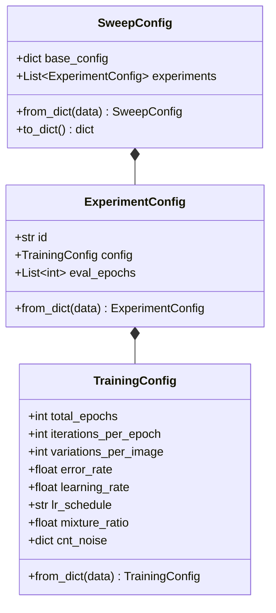
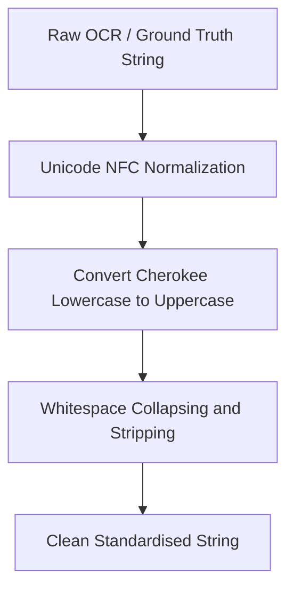

# Sweeps and Evaluation Architecture

This document details the architecture, configuration, execution flow, and evaluation strategies of the hyperparameter sweep and model validation subsystem in the Cherokee Phoenix OCR project.

---

## 1. Overview and Core Objectives

To achieve high-accuracy OCR on historical Cherokee prints while maintaining robustness across high-noise contexts (such as the Cherokee New Testament, or CNT), the project employs a Staged Epoch Loop training scheme. Fine-tuning models across vast augmentation and mixture ratios requires a reliable, isolated, and highly configurable hyperparameter sweep and evaluation architecture.

The core objectives of this architecture are:
*   **Hierarchical Configuration Management**: Allow broad base configurations while supporting fine-grained, nested experiment overrides.
*   **Isolated Experiment Execution**: Ensure sweeps run in strictly decoupled directories to avoid checkpoint pollution.
*   **Dual-Objective Tracking**: Keep track of the best-performing models under two separate criteria (pure Phoenix accuracy vs. combined weighted cross-domain performance).
*   **Direct-Line Evaluation Corrections**: Eliminate "false encoding errors" due to Unicode variations, Cherokee casing anomalies, and whitespace discrepancies during CER/WER calculation.

---

## 2. Nested Configuration and Hierarchical Inheritance

The sweep configuration leverages a multi-tier dataclass structure in `phoenix/config.py` to enable declarative execution of experiments.

### 2.1 The Dataclass Hierarchy



*   **`TrainingConfig`**: Defines specific execution parameters for the Staged Epoch Loop, including learning rate, schedules, noise/augmentation probabilities, dataset directories, and CNT mixture ratios.
*   **`ExperimentConfig`**: Couples a unique experiment identifier (`id`) with its `TrainingConfig` and a list of target sub-epochs to evaluate (`eval_epochs`).
*   **`SweepConfig`**: Represents a collection of experiments with an optional, shared `base` template config.

### 2.2 Hierarchical Inheritance & Deep-Merging

To avoid repeating identical configuration values across dozens of experiments in a single JSON file, `SweepConfig` supports a nested template-inheritance layout. 

```json
{
  "base": {
    "config": {
      "iterations_per_epoch": 200,
      "learning_rate": 0.0005,
      "cnt_noise": {
        "blur": {"prob": 0.6, "limit_min": 3, "limit_max": 5}
      }
    },
    "eval_epochs": [4, 8, 12]
  },
  "experiments": [
    {
      "id": "exp_mixture_90",
      "config": {
        "mixture_ratio": 0.9
      }
    },
    {
      "id": "exp_mixture_70",
      "config": {
        "mixture_ratio": 0.7,
        "learning_rate": 0.0002
      }
    }
  ]
}
```

During deserialization (`SweepConfig.from_dict()`), the system performs a nested, deep-merging resolution:

$$\text{Final Experiment Config} = \text{Base Config} \oplus \text{Experiment Overrides}$$

The merging logic is implemented via the `deep_merge` algorithm in `phoenix/config.py`:

```python
def deep_merge(base: dict, overrides: dict) -> dict:
    import copy
    result = copy.deepcopy(base)
    for k, v in overrides.items():
        if k in result and isinstance(result[k], dict) and isinstance(v, dict):
            result[k] = deep_merge(result[k], v)
        else:
            result[k] = copy.deepcopy(v)
    return result
```

This guarantees that:
1.  Nested structures, such as `cnt_noise` dictionary elements, are merged recursively rather than completely overwritten.
2.  If an experiment defines specific sub-parameters (e.g., `learning_rate` or custom noise), they override the inherited values.
3.  Evaluation epochs specified in `base` are inherited by all experiments unless explicitly overridden on a per-experiment level.

---

## 3. Sweeps & Training Orchestration Scripts

Two primary drivers orchestrate training runs and sweeps, decoupling the execution of the epoch loop from the parameter evaluation.

### 3.1 `scripts/train_staged.py`

This script represents the core orchestration runner for a single, staged training configuration:
*   **Enforces JSON configurations**: Expects a single `--config` argument pointing to a serialized `TrainingConfig`.
*   **Generates dynamic augmentations**: Spawns epoch-by-epoch images using defined noise distributions (blur, shadow, distortion, bleedthrough) with dynamic or fixed-mixture ratios.
*   **Tesseract Training**: Runs `lstmtraining` for the designated iterations per epoch.
*   **Peak Evaluation**: At completion, it extracts the top $N$ checkpoints from `train_output_dir`, compiles them using `--stop_training`, evaluates them using `scripts/evaluate_mixed_model.py`, and triggers `track_and_update_bests` to update the persistent top-performers.

### 3.2 `scripts/sweep_mixture_ratios.py`

Designed specifically for sweeping meta-parameters (such as Phoenix/CNT dataset mixture ratios), this script automates sequential multi-run experiments:
1.  Loads a `SweepConfig` from a JSON file.
2.  Loops through the parsed `experiments` list.
3.  Overrides the output directories for each experiment to run in strict isolation (`training_data/staged_tuning/{id}_output` and `training_data/staged_tuning/{id}_temp_epoch`).
4.  Launches `scripts/train_staged.py` as a separate subprocess for each experiment.
5.  Extracts specific sub-epoch checkpoints (using `eval_epochs`) via iteration calculation:

$$\text{Target Iteration} = \text{Epoch} \times \text{Iterations Per Epoch}$$

6.  Compiles temporary `.traineddata` files on-the-fly and scores them on both the Phoenix test split and the CNT test split.
7.  Saves a consolidated results JSON summarizing the metrics for all swept configurations, identifying the overall optimal parameters, and generating `configs/train_mixed.json` with the best mixture-ratio settings.

---

## 4. Bifurcated Layout (`best_model/`)

Because the training involves two distinct domains—high-quality historical page images (Phoenix) and high-noise Bible columns (CNT)—models often face a trade-off. Some configurations achieve flawless performance on the clean test set but struggle on high-noise samples, while others optimize for cross-domain stability at a slight cost to clean accuracy.

To accommodate this, the evaluation manager (`phoenix/training/eval.py`) implements a **Bifurcated Layout** under the `best_model/` directory:

```
best_model/
├── scoring_stats.json            <-- (Mirrored copy of the peak Phoenix CER stats)
├── best.checkpoint               <-- (Mirrored copy of the peak Phoenix checkpoint)
├── best.traineddata              <-- (Mirrored copy of the peak Phoenix compiled model)
├── best_config.json              <-- (Mirrored copy of the peak Phoenix training configuration)
├── phoenix/                      <-- Optimized PURELY for Phoenix accuracy
│   ├── best.checkpoint
│   ├── best.traineddata
│   ├── best_config.json
│   └── scoring_stats.json        <-- Contains lowest phoenix_CER
└── weighted/                     <-- Optimized for Overall Combined Weighted accuracy
    ├── best.checkpoint
    ├── best.traineddata
    ├── best_config.json
    └── scoring_stats.json        <-- Contains lowest weighted_CER
```

### 4.1 Persistence Update Rules

The `track_and_update_bests` routine implements atomic updates to prevent regression. When a checkpoint evaluation completes:

1.  **Phoenix Track**: 
    *   Inspects the candidate's `phoenix_CER`.
    *   If it is lower than the historical record stored in `best_model/phoenix/scoring_stats.json` (or if no previous run exists), the files inside `best_model/phoenix/` are replaced with the new model's files, and the `scoring_stats.json` file is updated.
    *   The updated Phoenix model is also mirrored to the root of the `best_model/` directory for simple consumption.

2.  **Weighted Track**:
    *   Inspects the candidate's `weighted_CER` (which averages Phoenix and CNT CER weighted by their respective line counts).
    *   If the candidate achieves a lower weighted CER than the historical record in `best_model/weighted/scoring_stats.json`, the contents of `best_model/weighted/` are updated.

This bifurcation ensures that production applications can choose between a specialized, high-accuracy model (Phoenix) and a highly robust, cross-domain model (Weighted) without manual bookkeeping.

---

## 5. Direct-Line Evaluation and Unicode Error Corrections

Standard Tesseract evaluations run on full multi-line pages can be polluted by layout analysis issues, line-order sorting failures, or false-positive segmentations. To isolate engine performance from layout engine quality, the validation subsystem implements **Direct-Line Evaluation**:
*   PNG crop slices containing single lines of text are fed directly into Tesseract in raw line mode (`--psm 13` - raw line, `--oem 1` - LSTM engine only).
*   The raw stdout streams are read directly and compared line-by-line with their corresponding `.gt.txt` ground-truth text files.

### 5.1 False Encoding Errors

During direct-line string comparisons, raw text outputs often suffer from "false encoding errors." These are differences that look like errors to standard character-matching algorithms but are semantically or visually identical in Cherokee.

The three primary causes of false errors are:
1.  **Unicode Decomposition Mismatch (NFC vs. NFD)**: Characters with diacritics can be represented as a single precomposed character (NFC) or split into base letters and combining diacritic marks (NFD). This triggers massive, artificial inflating of edit-distance.
2.  **Cherokee Case Confusion**: Traditional Cherokee has no case distinction. Historically, Cherokee letters were assigned to the uppercase block (U+13A0 to U+13F5). However, modern Unicode standards (Unicode 3.0 and 8.0) introduced a lowercase Cherokee block (U+13F8 to U+13FD and U+AB70 to U+ABBF). When models output lowercase variants or ground-truth files use mixed cases, standard CER calculations penalize them heavily.
3.  **Whitespace Discrepancies**: Inconsistent spacing (e.g., tabs, multiple spaces, thin spaces, trailing carriage returns) introduced during OCR generation falsely inflates Character and Word Error Rates.

### 5.2 The Normalization Solution (`normalize_truth`)

To guarantee highly accurate and authentic error calculations, all ground-truth strings and OCR outputs pass through the unified `normalize_truth` pipeline in `phoenix/text/normalization.py` before edit-distance calculation:



1.  **Unicode NFC Normalization**:
    ```python
    normalized = unicodedata.normalize("NFC", text)
    ```
    This squashes all decomposed accents and sequences into single precomposed codepoints.

2.  **Cherokee Casing Standardisation**:
    ```python
    normalized = normalized.upper()
    ```
    Converting strings to uppercase maps all lowercase Cherokee characters back into the unified traditional uppercase block (U+13A0 to U+13F5), ensuring character comparison matches on actual syllabary shapes instead of codepoint case variants.

3.  **Whitespace Collapsing**:
    ```python
    normalized = " ".join(normalized.split())
    ```
    Replaces all contiguous spaces, tabs, and line-breaks with a single space character and strips outer boundaries, isolating actual text recognition metrics from layout spacing noise.

By applying this rigorous normalization pipeline, the evaluation suite obtains a pure, highly reliable representation of model accuracy, allowing sweeps to optimize for real-world recognition performance instead of encoding-variant noise.
