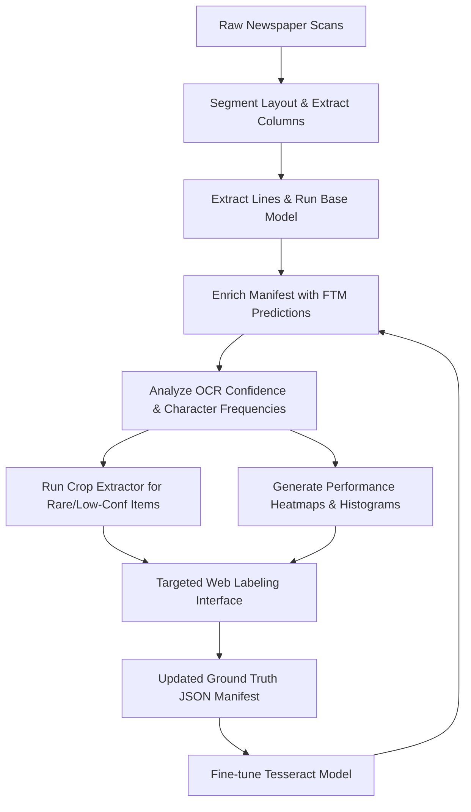

# Active Learning and Targeted Labeling Guide

This guide provides a comprehensive overview of the active learning and targeted labeling workflow in the Cherokee Phoenix OCR project. To optimize labeling efforts and maximize the ROI of human annotation, this system identifies, extracts, visualizes, and isolates low-confidence OCR predictions and rare/confused Cherokee characters for targeted review.

---

## 1. Active Learning Workflow Overview

The active learning pipeline is built on a feedback loop that continually refines Tesseract LSTM accuracy by focusing human attention on the model's weakest areas.



By prioritizing lines where the Fine-Tuned Model (FTM) has low confidence or predicts rare characters (such as `Ꮐ`, `Ꭾ`, `Ꮞ`, brackets `[`, `]`, or punctuation `?`), we avoid redundant labeling of high-confidence, repetitive texts.

---

## 2. Enriched FTM Predictions

The master manifest (`training_data/manifest_w_lang.json`) contains lines segmented from historical scans. To enable active learning, we enrich this manifest with word-level OCR confidence scores and transcriptions generated by our best fine-tuned Cherokee Tesseract LSTM model.

### FTM Enrichment Script

To generate or update these predictions, run the enrichment script:

```bash
# Process only new entries without existing FTM predictions
uv run python -m phoenix.manifest.enrich_manifest_with_ftm

# Force regeneration/overwrite of all existing predictions (e.g., after deploying a new model version)
uv run python -m phoenix.manifest.enrich_manifest_with_ftm --force
```

### JSON Schema Additions

The script modifies `manifest_w_lang.json` by appending or updating two key fields under each line crop's entry:
*   `ftm_ocr`: The raw string transcription predicted by the fine-tuned Tesseract LSTM.
*   `ftm_confidence`: A float representing the mean word-level confidence score (ranging from `0.0` to `100.0`).

#### Example Schema Entry
```json
{
  "crop_000412": {
    "image_path": "training_data/crops/crop_000412.png",
    "source_scan": "1828-11-19/seq-2.jp2",
    "column_index": 1,
    "line_index": 24,
    "line_bbox": [102, 1140, 984, 1215],
    "predicted_lang": "Cherokee",
    "status": "unlabeled",
    "initial_ocr": "ᎤᏂᎴᎩᏳ ᎢᏳᏍᏗ",
    "ftm_ocr": "ᎤᏂᎴᎩᏳ ᎢᏳᏍᏗ Ꮐ",
    "ftm_confidence": 74.25
  }
}
```

---

## 3. Crop Extractor Command

The targeted crop extractor locates and exports line crops meeting specific criteria (e.g., low-confidence levels combined with the occurrence of rare or highly confused Cherokee glyphs) into a dedicated, self-contained dashboard.

### Command Execution

Run the script from the root directory using `uv`:

```bash
uv run python -m phoenix.layout.extract_low_confidence_rare_crops \
  --manifest training_data/manifest_w_lang.json \
  --output-dir training_data/extracted_low_confidence_crops \
  --max-confidence 85.0 \
  --characters "4,?,[,],Ꮐ" \
  --max-results 200
```

### Parameters Breakdown

| Parameter | Type | Default | Description |
| :--- | :--- | :--- | :--- |
| `--manifest` | `str` | `training_data/manifest_w_lang.json` | Path to the source training manifest JSON. |
| `--output-dir` | `str` | `training_data/extracted_low_confidence_crops` | Directory where output assets, cropped images, and reports are saved. |
| `--max-confidence`| `float` | `85.0` | Maximum confidence threshold (0-100) below which lines are evaluated. |
| `--characters` | `str` | `4,?,[,],Ꮐ` | Comma-separated string list of target characters to match in `ftm_ocr`. |
| `--max-results` | `int` | `200` | Limits output size to the top $N$ lowest-confidence matches. |

### Output Artifacts

The extractor generates a structured package in the `--output-dir` path:
1.  **`images/`**: A subdirectory containing physical copies of matched line crop images named by their crop ID (e.g., `crop_000412.png`).
2.  **`summary.json`**: A clean, parsed metadata listing of all extracted crops.
3.  **`index.html`**: A highly interactive, responsive HTML dashboard for visualizing, sorting, and filtering the extracted crops directly within a web browser.

---

## 4. Performance Visualizations

To analyze model performance at a page-level and column-level, two visualization tools map confidence scores back to physical newspaper dimensions.

### A. Heatmaps with Column Offsets

The module `phoenix.visualization.generate_confidence_heatmaps` renders high-DPI overlays of segmented lines on top of the original historical scans. Bounding boxes are colored based on their OCR confidence scores, making spatial error patterns (such as page borders, ink bleed, or physical tears) immediately visible.

#### Handling Column Offsets
Line bounding boxes inside `manifest_w_lang.json` are often stored in coordinates *relative to their detected parent column crop*. To overlay them accurately on the original full-page scan, the visualization engine:
1.  Invokes layout analysis (`extract_columns` from `phoenix.layout`) on the full-page scan.
2.  Retrieves the absolute coordinates (`c_xmin`, `c_ymin`) of each column.
3.  Calculates the absolute page-level coordinates of each line bounding box:
    $$\text{abs\_xmin} = \text{bbox\_xmin} + (\text{c\_xmin} - 20)$$
    $$\text{abs\_ymin} = \text{bbox\_ymin} + (\text{c\_ymin} - 20)$$
4.  Applies a LANCZOS downsampling factor (typically `0.4`) to the high-resolution background image to maintain rapid rendering speeds and reasonable file sizes without sacrificing text clarity.

#### Coloring Logic
The bounding boxes are color-coded using the **`RdYlGn`** (Red-Yellow-Green) colormap normalized between $0\%$ and $100\%$ confidence:
*   🔴 **Red ($< 60\%$):** Severe misrecognitions, heavily skewed, or noisy regions.
*   🟡 **Yellow ($60\% - 85\%$):** Minor character confusion, boundary clippings, or rare glyphs.
*   🟢 **Green ($> 85\%$):** Highly confident, correct OCR transcriptions.

```bash
# Generate confidence heatmaps for selected key scans
uv run python -m phoenix.visualization.generate_confidence_heatmaps
```

### B. Column-Mean Histograms

The module `phoenix.visualization.generate_column_confidence_histogram` aggregates OCR performance to identify structurally weak columns. This is useful for identifying columns affected by global issues like localized camera defocus or ink fading.

1.  It groups lines by column key: `(source_scan, column_index)`.
2.  It filters out non-Cherokee text blocks and skips zero-confidence edge cases.
3.  It calculates the arithmetic mean of all line-level confidence scores in each column:
    $$\mu_{\text{col}} = \frac{1}{N} \sum_{i=1}^{N} \text{ftm\_confidence}_i$$
4.  It plots a distribution histogram using a Viridis colormap, highlighting the mean and median column-level performance across the entire corpus.

```bash
# Generate the distribution histogram
uv run python -m phoenix.visualization.generate_column_confidence_histogram
```

---

## 5. Web Labeling Interface

The web interface built inside `server/app.py` exposes specialized endpoints to support active learning and column-oriented labeling.

### Flask Routes and Business Logic

#### 1. Line-Level Annotator (`/training`)
Renders the standard line annotator dashboard, supporting an on-the-fly active learning filter.

*   **Endpoint:** `/training`
*   **Method:** `GET`
*   **Query Parameters:** `filter=rare`
*   **Business Logic:**
    *   Loads the master manifest JSON database.
    *   If `filter=rare` is active, it discards items unless `ftm_confidence <= 85.0` AND the predicted text contains one of the targeted rare characters (`[`, `]`, `4`, `Ꮞ`, `?`, `Ꭾ`).
    *   If a line crop lacks a pre-calculated layout or linguistic classification, the route runs `analyze_text` on-the-fly to classify and attach its structural tag.
    *   Passes filtered elements and aggregated database status metrics to the template.

#### 2. Label Update Handler (`/training/update`)
Saves individual manual transcription corrections.

*   **Endpoint:** `/training/update`
*   **Method:** `POST`
*   **Payload (JSON):**
    ```json
    {
      "id": "crop_000412",
      "status": "labeled",
      "label": "ᎤᏂᎴᎩᏳ ᎢᏳᏍᏗ Ꮐ"
    }
    ```
*   **Business Logic:** Writes the updated manual string label and state (e.g., `labeled`, `not_cherokee`, `nasty_crop`) directly to the manifest, serializing the file synchronously to prevent data loss.

#### 3. Column-Level Bulk Annotator (`/training/columns`)
Supports bulk labeling of sequential lines within low-confidence columns to preserve reading context.

*   **Endpoint:** `/training/columns`
*   **Method:** `GET`
*   **Query Parameters:** `threshold=75.0`, `col_id=<id>`
*   **Business Logic:**
    *   Calls `get_low_confidence_columns` to load, group, and score all text columns in the manifest.
    *   Isolates columns with a mean confidence below the threshold (default: $75.0\%$).
    *   Sorts columns to prioritize those containing unlabeled lines, followed by lowest mean confidence.
    *   Renders a split-pane interface with the column list on the left and sequential line cards of the active column on the right.

#### 4. Bulk Column Save Handler (`/training/columns/save`)
Processes bulk annotation updates submitted for an entire column at once.

*   **Endpoint:** `/training/columns/save`
*   **Method:** `POST`
*   **Payload (JSON):**
    ```json
    {
      "updates": {
        "crop_000412": { "label": "ᎤᏂᎴᎩᏳ ᎢᏳᏍᏗ Ꮐ", "status": "labeled" },
        "crop_000413": { "label": "ᎾᏍᎩ ᎢᏳᏍᏗ", "status": "labeled" }
      }
    }
    ```
*   **Business Logic:** Iterates through the collection of updates, applies the corrections to the master manifest, and saves the file to disk in a single write operation.

---

## 6. HTML Templates and Layouts

The interface templates are stored in `server/templates/` and utilize standard HTML5, CSS Grid/Flexbox, and native fetch APIs for responsive interactions.

### A. Line Labeling Template (`training.html`)
Renders a grid-based card layout for quick individual reviews.

*   **Status Metrics Bar:** A top stats panel showing total, unlabeled, labeled, non-Cherokee, and nasty crop totals.
*   **Active Learning Toggle:** A dedicated UI toggle to reload the page with `?filter=rare` to focus only on difficult rare-character segments.
*   **Line Card Elements:**
    *   The line crop image, served via `/training_data/<path:filename>`.
    *   A badge indicating its on-the-fly layout classification.
    *   A text input pre-populated with either the existing ground truth `label` or fallback `ftm_ocr` prediction.
    *   State buttons: **Labeled** (Save), **Not Cherokee** (Flag as English/noise), and **Nasty Crop** (Flag as bad segmentation/blurry).
*   **Asynchronous Commit:** Event listeners bind to key presses (`Ctrl+Enter`) and clicks, calling `/training/update` via `fetch` to save without full page reloads.

### B. Column Bulk Review Template (`columns.html`)
Renders a dual-pane sidebar layout engineered for high-throughput column reviews.

*   **Left Sidebar (Column Directory):** Lists all columns scoring below the confidence threshold. Each column item shows:
    *   The newspaper issue name (`source_scan`) and column index.
    *   A color-coded progress bar representing labeled vs. unlabeled percentages.
    *   The mean confidence score, styled red-to-green matching the heatmap color logic.
*   **Right Main Pane (Interactive Column Workspace):** Shows the sequential list of line crops for the selected column.
    *   Displays the full reconstructed column context, making it easy to decipher difficult characters using surrounding lines.
    *   Features a **Bulk Apply** panel to quickly set common labels or mark multiple lines as "Not Cherokee" or "Nasty Crop" simultaneously.
    *   Features a **Save Column** button that collects all text inputs on the screen and sends a single bulk payload to `/training/columns/save`.
