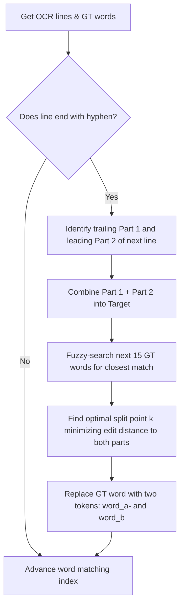
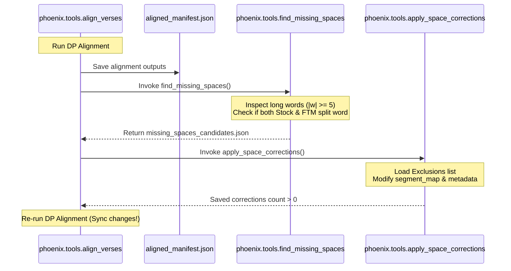

# Cherokee New Testament (CNT) Integration Guide

The Cherokee New Testament (CNT) corpus is a critical training, validation, and historical baseline dataset for the Cherokee Phoenix OCR project. This document serves as the master guide for integrating the CNT corpus into the OCR dataset pipelines. It details the corpus directory layouts, the mathematical formulation of the dynamic programming sequence alignment algorithm, hyphenation boundary heuristics, the space auto-correction loop, and the exact commands to execute these workflows.

---

## 1. Directory & Dataset Structure

Each book of the Cherokee New Testament is managed within its own subdirectory under the `training_data/cnt/` path. This localized organization ensures that all inputs, raw line crops, intermediate manifests, and diagnostic outputs are kept self-contained and auditable.

The directory layout of a typical book (e.g., Book 1) is structured as follows:

```
training_data/cnt/book_01/
├── line_crops/                            # Extracted raw image snippets for each line
│   ├── verse_001_line_0.png
│   ├── verse_001_line_1.png
│   └── ...
├── metadata.json                          # Full verse-level transcriptions and image path mappings
├── segment_map.json                       # Links verse keys to relative crop paths and ground-truth text
├── aligned_manifest.json                  # Output of the alignment algorithm (synced words per crop)
├── alignment_verification.html            # Diagnostic dashboard visualizing physical vs. text alignment
├── missing_spaces_candidates.json         # Detected candidate typos for human/automated space insertion
└── space_correction_exclusions.json       # User-defined word lists to ignore during auto-correction
```

### Core Data File Formats

#### `segment_map.json`
This file is the primary input to the alignment step. It defines the mapping from each verse key to the physical image assets (crops) and the corresponding clean Cherokee ground-truth text.

```json
{
  "verse_0101": {
    "image_path": "pages/page_01.png",
    "cherokee": "ᎣᎩᏙᏓ ᎦᎸᎳᏗ ᎮᎯ ᎦᎸᏉᏗᏳ ᎨᏎᏍᏗ ᏕᏣᏙᎥᎢ.",
    "line_crops": [
      "line_crops/verse_0101_line_0.png",
      "line_crops/verse_0101_line_1.png"
    ]
  }
}
```

#### `aligned_manifest.json`
Generated by `phoenix.tools.align_verses`, this file details the final words assigned to each line crop, recording both the raw OCR outputs (stock and fine-tuned model versions) and the aligned ground-truth text.

```json
{
  "verse_0101": {
    "image_path": "pages/page_01.png",
    "cherokee_gt": "ᎣᎩᏙᏓ ᎦᎸᎳᏗ ᎮᎯ ᎦᎸᏉᏗᏳ ᎨᏎᏍᏗ ᏕᏣᏙᎥᎢ.",
    "verse_number": "1",
    "lines": [
      {
        "line_crop": "line_crops/verse_0101_line_0.png",
        "stock_aligned": "1 ᎣᎩᏙᏓ ᎦᎸᎳᏗ ᎮᎯ",
        "stock_raw_ocr": "ᎣᎩᏙᏓ ᎦᎸᎳᏗ ᎮᎯ",
        "ftm_aligned": "1 ᎣᎩᏙᏓ ᎦᎸᎳᏗ ᎮᎯ",
        "ftm_raw_ocr": "ᎣᎩᏙᏓ ᎦᎸᎳᏗ ᎮᎯ",
        "ftm_confidence": 94.50
      },
      {
        "line_crop": "line_crops/verse_0101_line_1.png",
        "stock_aligned": "ᎦᎸᏉᏗᏳ ᎨᏎᏍᏗ ᏕᏣᏙᎥᎢ.",
        "stock_raw_ocr": "ᎦᎸᏉᏗᏳ ᎨᏎᏍᏗ ᏕᏣᏙᎥᎢ",
        "ftm_aligned": "ᎦᎸᏉᏗᏳ ᎨᏎᏍᏗ ᏕᏣᏙᎥᎢ.",
        "ftm_raw_ocr": "ᎦᎸᏉᏗᏳ ᎨᏎᏍᏗ ᏕᏣᏙᎥᎢ.",
        "ftm_confidence": 98.20
      }
    ]
  }
}
```

---

## 2. Sequence Alignment via Dynamic Programming

The main computational challenge in incorporating the CNT is aligning the continuous running ground-truth verse text into segment-by-segment transcriptions that correspond perfectly to the physical line crops.

The alignment is implemented as a **Dynamic Programming (DP)** optimization in `phoenix/tools/align_verses.py` under the function `align_words_to_lines`. 

### Mathematical Formulation

Let:
*   $W = [w_0, w_1, \dots, w_{M-1}]$ be the ordered list of $M$ ground-truth words for a given verse.
*   $L = [l_0, l_1, \dots, l_{N-1}]$ be the ordered list of $N$ physical line crops.
*   $O = [o_0, o_1, \dots, o_{N-1}]$ be the noisy, raw OCR transcriptions obtained from running Tesseract on the crops.
*   $\text{Lev}(s_1, s_2)$ be the Levenshtein distance (edit distance) between two strings.
*   $\text{Join}(W[i:k])$ be the string formed by joining the sub-array of words from index $i$ to $k-1$ with single spaces.

We define the DP state $DP(i, j)$ as the minimum alignment cost for matching the suffix of words $W[i:]$ to the suffix of OCR lines $L[j:]$.

#### Recurrence Relation
For $0 \le i \le M$ and $0 \le j < N-1$:
$$DP(i, j) = \min_{i \le k \le M} \left\{ \text{Lev}\left(\text{Join}(W[i:k]), o_j\right) + DP(k, j+1) \right\}$$

#### Base Conditions
1. **Last Line Constraint ($j = N-1$):**
   The last physical line must consume all remaining ground-truth words to ensure no text is left unassigned:
   $$DP(i, N-1) = \text{Lev}\left(\text{Join}(W[i:M]), o_{N-1}\right)$$

2. **Out of Words ($i = M$ and $j < N$):**
   If we run out of ground-truth words but still have physical line crops left, the remaining lines are aligned with empty strings, adding their full insertion/deletion penalty:
   $$DP(M, j) = \sum_{r=j}^{N-1} \text{Lev}\left("", o_r\right)$$

### Optimization & Memoization
The search space is evaluated using a top-down recursive strategy with a memoization table `memo` keyed on the state tuple $(i, j)$. This reduces the time complexity from exponential to $\mathcal{O}(M^2 \cdot N)$, which executes in milliseconds per verse.

---

## 3. Hyphenation Heuristics & Boundary Handling

In historical printed Cherokee texts, long words are frequently split across physical line breaks. The compositor inserts a trailing hyphen (`-`) at the end of the first line, and prints the remainder of the word at the start of the next line.

Direct alignment of the original ground-truth words fails because a single word in $W$ corresponds to parts of two different physical lines. To resolve this, the pipeline executes a pre-processing step called `preprocess_hyphenated_words` prior to running the DP alignment.



### Hyphenation Splitting Algorithm

1. **Detection:** The trailing tokens of each physical line OCR are inspected. If a line $l_i$ ends with a hyphen (or if the penultimate word ends with a hyphen and the final word is a tiny OCR noise artifact $\le 2$ chars), a hyphenated line-break is flagged.
2. **Target Formulation:** Let the trailing hyphenated part be $p_1$ and the leading token of the next line $l_{i+1}$ be $p_2$. We formulate a clean target word:
   $$\text{Target} = \text{Clean}(p_1) + \text{Clean}(p_2)$$
3. **Fuzzy Selection:** We search the ground-truth word list $W$ starting from the current tracking index up to a window of 15 words. The word $w_m$ that minimizes $\text{Lev}(\text{Clean}(w_m), \text{Target})$ is selected, provided the edit distance is within $40\%$ of the word's length and $\le 3$.
4. **Optimal Split Calculation:** To partition $w_m$ into two parts $w_{m,1}$ and $w_{m,2}$ matching the physical layout split, we find index $k$ ($1 \le k < |w_m|$) that minimizes:
   $$\text{Cost}(k) = \text{Lev}(\text{Clean}(w_m[:k]), \text{Clean}(p_1)) + \text{Lev}(\text{Clean}(w_m[k:]), \text{Clean}(p_2))$$
5. **In-place Substitution:** The original word $w_m$ in $W$ is substituted with two separate tokens:
   $$[w_m] \to [w_m[:k] + \text{"-"}, w_m[k:]]$$
   This splits the ground truth token cleanly, allowing the DP alignment algorithm to map the first part to line $l_i$ and the second part to line $l_{i+1}$ with zero alignment error.

---

## 4. Auto-Correction Loop for Missing Spaces

A frequent typographical error in historical Cherokee ground-truth transcriptions is the complete omission of spaces between adjacent words. This manifests as single long words in the ground-truth text that correspond to two distinct words output by both OCR models.

The system resolves this via an automated **Iterative Feedback Loop** across three modules: `phoenix.tools.find_missing_spaces`, `phoenix.tools.apply_space_corrections`, and the main orchestrator `phoenix.tools.align_verses`.



### Detection Logic
For each ground-truth word $w$ where $|w| \ge 5$, the algorithm evaluates every hypothetical split point $s$ ($2 \le s < |w| - 1$):
$$\text{Part}_1 = w[:s], \quad \text{Part}_2 = w[s:]$$
The candidate is flagged as a genuine missing space typo if and only if **both** conditions are met:
1. The stock Tesseract model recognizes two separate adjacent tokens $t_1, t_2$ such that $\text{Lev}(t_1, \text{Part}_1) \le 0.15 \cdot |\text{Part}_1|$ and $\text{Lev}(t_2, \text{Part}_2) \le 0.15 \cdot |\text{Part}_2|$.
2. The fine-tuned Tesseract model (FTM) also recognizes two separate adjacent tokens matching those boundaries.
3. The split occurs either within the same line or across lines where no hyphen was printed (to differentiate from natural line-breaks).

### Exclusions & Application
To prevent false-positives (e.g., cases where both OCR models make the exact same character recognition mistake on a valid long word), users can record exceptions in `space_correction_exclusions.json`. 

When `phoenix.tools.apply_space_corrections` executes, it filters out these exceptions and modifies both `segment_map.json` and `metadata.json` to insert spaces at the flagged indices. If any changes are written, `phoenix.tools.align_verses` catches the file modification and triggers a secondary alignment pass to output a clean, final `aligned_manifest.json`.

---

## 5. Operational Commands & Execution

To maintain system cleanliness and enforce dependency reproducibility, all python processes must be run using **`uv`**.

### 1. Perform Text-to-Line Alignment
To align a book's ground-truth verses to its physical line crops using both the base stock model and a fine-tuned model checkpoint, run:
```bash
uv run python -m phoenix.tools.align_verses \
  --book-dir training_data/cnt/book_01 \
  --model-dir training_data/dataset/model \
  --model-name chr_best_finetuned
```
*Parameters:*
*   `--book-dir`: The target directory containing the book's assets and `segment_map.json`.
*   `--model-dir`: The local directory where fine-tuned `.traineddata` files reside.
*   `--model-name`: The base filename of the fine-tuned Tesseract model (omitting the `.traineddata` extension).

### 2. Manual Missing Space Detection
To inspect the alignment output and isolate missing space candidates into a standalone JSON report without altering any master data files:
```bash
uv run python -m phoenix.tools.find_missing_spaces \
  --manifest training_data/cnt/book_01/aligned_manifest.json \
  --output training_data/cnt/book_01/missing_spaces_candidates.json
```

### 3. Apply Space Corrections
To apply the detected corrections directly back to the source files (`segment_map.json` and `metadata.json`), while respecting exclusions:
```bash
uv run python -m phoenix.tools.apply_space_corrections \
  --book-dir training_data/cnt/book_01 \
  --exclusions training_data/cnt/book_01/space_correction_exclusions.json
```

### 4. Continuous Integration Batch Script
For bulk processing across the entire New Testament corpus, a simple bash shell loop can be executed to process multiple books sequentially:
```bash
for book_dir in training_data/cnt/book_*; do
  echo "=== Processing $book_dir ==="
  uv run python -m phoenix.tools.align_verses \
    --book-dir "$book_dir" \
    --model-dir training_data/dataset/model \
    --model-name chr_best_finetuned
done
```
This processes and aligns all books, runs auto-corrections, and produces HTML verification sheets in each directory.
