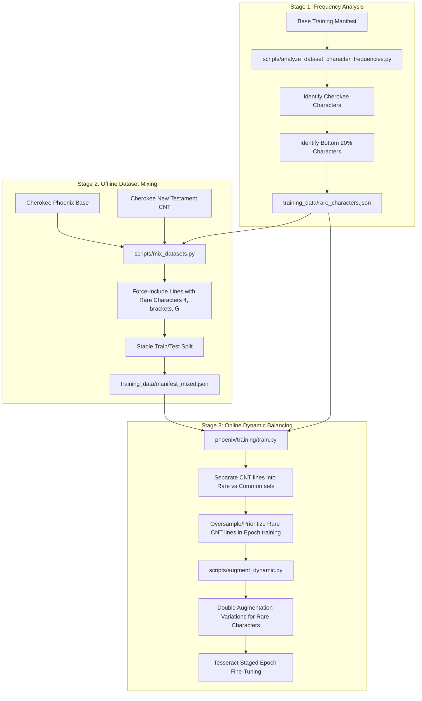

# Cherokee Phoenix OCR: Text Normalization and Unicharset Guide

This document serves as the technical reference guide for the Cherokee Phoenix OCR data processing pipeline. It details the text normalization procedures, Tesseract unicharset manipulations, traineddata compilation commands, character-level dynamic programming (DP) alignment for error analysis, and the 3-stage rare character class balancing pipeline.

---

## 1. 3-Stage Text Normalization

To ensure consistent model evaluation and avoid false discrepancies during training, all transcription text (ground truth and OCR predictions) is processed through a strict, centralized 3-stage normalization pipeline implemented in `phoenix/text/normalization.py`.

```python
import unicodedata

def normalize_truth(text: str) -> str:
    if not text:
        return ""
    
    # 1. Unicode NFC normalization
    normalized = unicodedata.normalize("NFC", text)
    
    # 2. Convert Cherokee lowercase to uppercase
    normalized = normalized.upper()
    
    # 3. Whitespace normalization (replace multiple whitespace with a single space, strip)
    normalized = " ".join(normalized.split())
    
    return normalized
```

### Stage 1: Unicode NFC Normalization
Cherokee syllables and historic characters can be represented in different Unicode forms (e.g., decomposed vs. composed characters). We enforce **NFC (Normalization Form Canonical Composition)**, which translates decomposed character sequences into their single-character canonical equivalents. This eliminates issues where visual matches fail string comparison checks due to byte-level sequence differences.

### Stage 2: Cherokee Lowercase-to-Uppercase Conversion
Historically, Tesseract models and ground-truth transcriptions of Cherokee have predominantly utilized uppercase representation. To maintain maximum compatibility and avoid vocabulary fragmentation:
* Any lowercase Cherokee characters (within Unicode ranges `0xAB70` to `0xABBF`) are mapped to their uppercase counterparts (Unicode ranges `0x13A0` to `0x13F5`) using `.upper()`.
* This normalizes historical documents and synthetic variations to a unified casing layer.

### Stage 3: Whitespace Standardization
To prevent line spacing and structural formatting from skewing character-level metrics:
* Consecutive whitespaces (spaces, tabs, newlines) are consolidated into a single standard space character `0x0020`.
* Leading and trailing whitespaces are completely stripped using Python's `" ".join(text.split())` logic.

---

## 2. Tesseract Unicharset Format Manipulations

Unicharset files act as the lexicon for Tesseract's OCR engine, specifying properties, bounding boxes, and classifications for every valid character. The system utilizes two unicharset formats depending on the pipeline stage: **Target Style (Simple)** and **Starter Style (Complex)**.

### Target Style (Simple)
This format is used for final production and testing outputs where detailed character glyph metrics are either redundant or generated dynamically.
* **Property values**: Employs simplified, broad class properties (e.g., `8` for numbers, `16` for punctuation, `5` or `1` for alphabetic/Cherokee characters).
* **Bounding box metrics**: Enforces a fallback zero-bounding box configuration:
  `0,255,0,255,0,0,0,0,0,0`
* **Character Category**: Explicitly classifies Cherokee scripts with category `A` (Alphabetic), and non-Cherokee characters with their default category identifiers.

### Starter Style (Complex)
This format is required during early training or base model construction to inform the LSTM model of the expected geometric properties and font glyph metrics for each character class.
* **Property values**: Employs fine-grained, localized property classes.
* **Bounding box metrics**: Implements explicit bounding box measurements mapped to representative Cherokee and common punctuation font metrics:
  * Digit `4`: `0,66,196,255,84,158,0,32,103,173`
  * Brackets `[` and `]`: `14,56,131,221,17,93,0,58,38,173`
  * Historic Cherokee `Ꮐ`: `64,64,255,255,174,190,8,27,195,211`
  * Question Mark `?`: `41,67,216,255,11,87,0,71,50,173`
* **Character Category**: Preserves detailed category identifiers (e.g., `p` for punctuation, `x` for unique glyph subclasses).

A typical unicharset entry conforms to the following structural format:
```text
<char> <properties> <bounding_box_metrics> <script> <id> <direction> <id> <char># <char> [<hex_code> ]<category>
```

*Example target vs. starter entry for character `4`:*
```text
# Target Style (Simple)
4 8 0,255,0,255,0,0,0,0,0,0 Common 92 2 92 4	# 4 [34 ]0

# Starter Style (Complex)
4 8 0,66,196,255,84,158,0,32,103,173 Common 92 2 92 4	# 4 [34 ]0
```

---

## 3. Tesseract Traineddata Compilation Commands

Tesseract packages its configurations, dictionaries, unicharsets, and neural network checkpoints into a single unified `.traineddata` file. We use `combine_tessdata` to compile and manage these packages.

### Extracting Components from Traineddata
To decompose an existing `.traineddata` archive into individual files (e.g., to modify `lstm-unicharset`):
```bash
# Extracts all components from chr.traineddata using the prefix "chr."
combine_tessdata -u chr.traineddata chr.
```
This command generates files such as `chr.lstm`, `chr.lstm-unicharset`, `chr.config`, etc.

### Overwriting/Injecting Components
To rebuild or update a component inside a `.traineddata` archive without affecting other elements:
```bash
# Overwrite or inject an updated unicharset file into the target traineddata archive
combine_tessdata -o chr.traineddata chr.lstm-unicharset
```
> [!IMPORTANT]
> When executing `combine_tessdata -o`, ensure the component file matches the internal file naming convention expected by Tesseract. The command should be executed within the directory containing both files.

### Verifying and Inspecting Components
To verify that the unicharset and other components have been compiled correctly and to view the table of contents:
```bash
# Displays a listing of all packed components and their byte offsets
combine_tessdata -d chr.traineddata
```

---

## 4. Dynamic Programming (DP) Alignment Confusion Matrix

To precisely identify OCR systematic errors (where the model confuses look-alike Cherokee characters), the script `scripts/generate_confusion_matrix.py` performs a character-by-character alignment of the normalized ground truth and OCR prediction using a Dynamic Programming (DP) edit distance algorithm.

### Mathematical Formulation

Let $T = t_1 t_2 \dots t_m$ be the ground truth string, and $P = p_1 p_2 \dots p_n$ be the predicted OCR string.

We construct a dynamic programming table $DP$ of size $(m+1) \times (n+1)$, where $DP[i][j]$ represents the minimum edit distance between the prefix $T[1..i]$ and $P[1..j]$.

#### Base Cases
$$DP[i][0] = i \quad \forall \ i \in [0, m]$$
$$DP[0][j] = j \quad \forall \ j \in [0, n]$$

#### Recurrence Relation
For $i > 0$ and $j > 0$:
$$DP[i][j] = \begin{cases} 
DP[i-1][j-1] & \text{if } t_i = p_j \ (\text{Match}) \\
1 + \min \begin{cases} 
DP[i-1][j-1] & \text{Substitution } (t_i \to p_j) \\
DP[i-1][j] & \text{Deletion } (t_i \to \varepsilon) \\
DP[i][j-1] & \text{Insertion } (\varepsilon \to p_j)
\end{cases} & \text{if } t_i \neq p_j 
\end{cases}$$

#### Backtracking Rules
We backtrack from $DP[m][n]$ to $DP[0][0]$ to reconstruct the alignment sequence. At cell $(i, j)$:
1. If $i > 0$, $j > 0$ and $t_i = p_j$, we align $t_i$ and $p_j$ as a **Match** and move to $(i-1, j-1)$.
2. Else if $i > 0$, $j > 0$ and $DP[i][j] = DP[i-1][j-1] + 1$, we align $t_i$ and $p_j$ as a **Substitution** and move to $(i-1, j-1)$.
3. Else if $i > 0$ and $DP[i][j] = DP[i-1][j] + 1$, we record a **Deletion** of $t_i$ and move to $(i-1, j)$.
4. Else if $j > 0$ and $DP[i][j] = DP[i][j-1] + 1$, we record an **Insertion** of $p_j$ and move to $(i, j-1)$.

### Confusion Matrix Compilation
Once characters are aligned across the test dataset, they are compiled into a comprehensive confusion matrix. This matrix lists:
* **Substitutions**: Frequency of character $t_a$ recognized as $p_b$.
* **Deletions**: Frequency of character $t_a$ dropped entirely by OCR.
* **Insertions**: Frequency of character $p_b$ hallucinated by OCR.

The results are exported to `training_data/performance_analysis/confusion_matrix.csv` (for programmatic parsing) and formatted into a markdown summary (`confusion_matrix.md`) to guide targeted data collection.

---

## 5. 3-Stage Rare Character Balancing Pipeline

Cherokee texts have highly skewed syllable frequency distributions, causing standard fine-tuned models to perform poorly on rare or historic syllables. To address this class imbalance, we implement a highly structured **3-Stage Rare Character Balancing Pipeline**.



### Stage 1: Frequency Analysis and Identification
* The script `scripts/analyze_dataset_character_frequencies.py` scans all labeled Cherokee entries within the active training manifest.
* It filters out non-Cherokee characters, focusing exclusively on the Cherokee Unicode blocks (`0x13A0` to `0x13FF` and `0xAB70` to `0xABFF`).
* It sorts unique Cherokee characters in ascending order of frequency. The bottom 20% of under-represented characters are designated as "rare characters" and saved to `training_data/rare_characters.json`.

### Stage 2: Offline Dataset Mixing and Stable Sampling
* The script `scripts/mix_datasets.py` blends the Cherokee Phoenix base training dataset with a 10% subset of the Cherokee New Testament (CNT) dataset.
* To prevent rare characters from being omitted during random sampling, the script force-includes all valid lines containing:
  * The numeric identifier `'4'`.
  * The punctuation brackets `'['` and `']'`.
  * The historic Cherokee syllable `'Ꮐ'` (nah).
* The resulting mixed dataset split is assigned stably using deterministic seeded generators (`random.Random(seed)`), preventing data leakage between the train and test splits.

### Stage 3: Online Dynamic Balancing & Heavier Augmentation
During active model fine-tuning within the Staged Epoch Loop:
1. **Dynamic Oversampling**: `phoenix/training/train.py` reads `rare_characters.json` and splits available CNT lines into "rare-containing" and "common" lists. When assembling the dynamic dataset for each training epoch, lines containing rare characters are shuffled and prioritized first to fill the allocated dynamic sample size (`n_cnt`), ensuring high representation.
2. **Double Augmentation Variations**: In `scripts/augment_dynamic.py`, any training crop that contains one or more rare characters receives double the target dynamic augmentations (`variations = target * 2`). This forces the training engine to observe twice as many deformed, binarized, and noise-injected samples of rare characters, accelerating the convergence of rare softmax logit weights.
