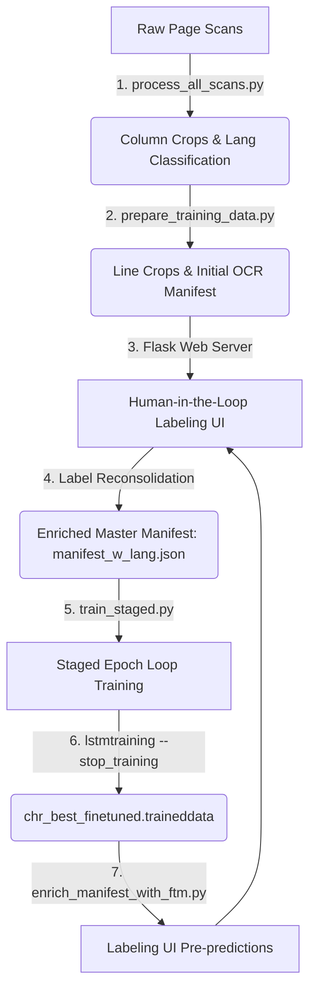

# Cherokee OCR Operations Guide

This guide is the master operations manual ("README") for the Cherokee Phoenix OCR project. It details the end-to-end workflow from processing raw page scans to fine-tuning the Tesseract LSTM model, managing annotations, and deploying the model for inference in the labeling interface.

---

## Workflow Overview

The diagram below illustrates the iterative fine-tuning pipeline:



---

## 1. Preparing Column and Line Data from Scans

Raw scans (JPEG 2000 format `.jp2`) are downloaded or placed in the `scans/` directory.

### Step A: Download Raw Scans (Optional)
If you have new seed URLs from the Georgia Historic Newspapers archive, you can download them using:
```bash
.venv/bin/python scripts/download_scans.py <path_to_urls_file>
```

### Step B: Process Scans and Categorize Columns
To recursively crawl the raw scans, segment columns, perform skew correction, and classify columns by language (Cherokee, English, or Other), run:
```bash
.venv/bin/python scripts/process_all_scans.py
```
This extracts layout columns into `training_data/` sorted folders.

### Step C: Extract Line Crops & Initial OCR Manifest
To segment text lines inside the identified Cherokee/Mixed columns using Surya layout detection and write initial Tesseract OCR transcription guesses to the master manifest:
```bash
.venv/bin/python scripts/prepare_training_data.py --input-dir scans --output-dir training_data
```
*   **Language Metadata**: For each column, OCR is performed with `chr+eng` to compute character/word distributions. Columns with Cherokee content are classified as `Cherokee` or `Mixed` (`scripts/classify_layout.py`) and scheduled for line extraction.
*   Once line crops are extracted, `scripts/add_predicted_lang_to_manifest.py` is invoked to add specific language metadata classifications (`Cherokee`, `English`, or `Mix`) for each line crop entry:
    ```bash
    .venv/bin/python scripts/add_predicted_lang_to_manifest.py
    ```
    This generates/updates `training_data/manifest_w_lang.json`.

---

## 2. Starting the Labeling Server

The human-in-the-loop web interface allows you to view crops, correct transcriptions, and mark lines as verified.

To run the Flask labeling server locally:
```bash
export FLASK_APP=server/app.py
export PORT=5000
.venv/bin/flask run --host=0.0.0.0 --port=$PORT
```
Open your browser and navigate to `http://localhost:5000` to start labeling. The server interacts directly with `training_data/manifest_w_lang.json`.

---

## 3. Building a Dataset from Labeled Data

Once humans have corrected or validated labels in the UI, you need to extract the ground-truth text and compile Tesseract training box/image triplets.

### Step A: Reconsolidate Existing Labels (If migrating)
If you need to transfer manual labels from the older version `training_data/manifest.json` to the newer `training_data/manifest_w_lang.json` using fuzzy matching:
```bash
.venv/bin/python scripts/reconsolidate_labels.py --old-manifest training_data/manifest.json --new-manifest training_data/manifest_w_lang.json
```

### Step B: Format the Dataset and Split Train/Test
Tesseract training requires splitting the labeled data into independent Train (80%) and Test (20%) datasets to prevent corruption and evaluate accuracy.

1.  **Generate Dataset Split Triplets**:
    ```bash
    .venv/bin/python scripts/split_train_test.py
    ```
    This segments assets into `training_data/dataset/train_80/` and `training_data/dataset/test_20/`.
2.  **Generate `.lstmf` Files**:
    Run the compilation shell script to generate binary Tesseract LSTM training files:
    ```bash
    ./scripts/prepare_splits.sh
    ```
    This script executes Tesseract with `lstm.train` configuration on the splits, creating the lists `list.train` and `list.test`.

> [!NOTE]
> The **Staged Epoch Loop** (`scripts/train_staged.py`) does **not** require running `prepare_splits.sh` beforehand. The staged loop dynamically splits the dataset in-memory and compiles training `.lstmf` files on-the-fly in a temporary directory. `prepare_splits.sh` is only needed if you are running static, offline training/evaluation (e.g. via `train_split.sh` or `evaluate_split.sh`).

---

## 4. Training the Model

Training Cherokee OCR uses a **Staged Epoch Loop** pipeline that applies dynamic augmentations (elastic distortions, morphological erosion/dilation) on-the-fly each epoch while keeping disk usage low.

### Step A: Run Production Training with Best Parameters
Based on systematic parameter tuning, the optimal parameters are:
*   **Total Epochs**: 8
*   **Iterations per Epoch**: 200 (1600 iterations total)
*   **Variations per Image**: 3
*   **Synthetic Transcription Error Rate**: 0.05

Run the training loop:
```bash
.venv/bin/python scripts/train_staged.py \
  --total-epochs 8 \
  --iterations-per-epoch 200 \
  --variations-per-image 3 \
  --error-rate 0.05 \
  --train-manifest training_data/manifest_w_lang.json \
  --output-dir training_data/dataset_epoch \
  --model-dir training_data/dataset/model \
  --train-output-dir training_data/dataset_staged_output
```

### Step B: How to Redo Metaparameter Search
If you want to perform a systematic One-at-a-Time (OAT) tuning sweep over different values of iterations, error injection rates, or epochs:
```bash
.venv/bin/python scripts/tune_meta_parameters.py
```
This runs the matrix of experiment configurations specified in the script and calculates character/word error rates against the test split directory.

---

## 5. Rebuilding the Finetuned Model for Inference

Tesseract outputs model checkpoints (`.checkpoint` files) during training. To build the final inference model:

### Step A: Package the Best Checkpoint
Run `lstmtraining` with the `--stop_training` flag to convert the best checkpoint into a deployable `.traineddata` file:
```bash
lstmtraining \
  --stop_training \
  --continue_from training_data/dataset_staged_output/chr_checkpoint \
  --traineddata training_data/dataset/model/chr.traineddata \
  --model_output training_data/dataset/model/chr_best_finetuned.traineddata
```

### Step B: Add Inferences to the Labeling Server
To display predictions from your new model as interactive suggestions inside the UI:

1.  **Regenerate predictions in the manifest**:
    Use the FTM enrichment script to parse line crops using your newly packaged `chr_best_finetuned.traineddata` model:
    ```bash
    # Force recalculation of all predictions
    .venv/bin/python scripts/enrich_manifest_with_ftm.py --force
    ```
2.  **Restart the web server**:
    Once the enrichment script finishes updating `training_data/manifest_w_lang.json`, restart the Flask web server to see the updated FTM predictions and confidence values in the interface.
