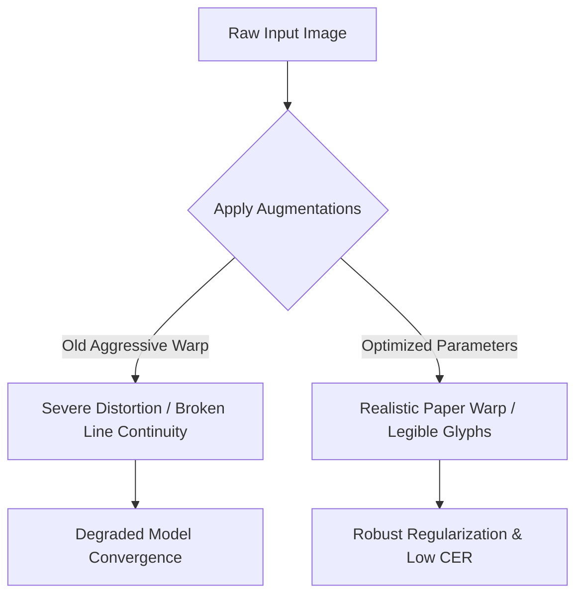

# Grayscale and Binarization Optimization Report

This document details the research, evaluation, and optimization of image preprocessing, binarization, and geometric augmentation strategies within the Cherokee Phoenix OCR pipeline. It synthesizes insights from extensive sweeps across 31 binarization variations, explains key pipeline exclusions, evaluates spatial warp boundaries, and provides a deep mathematical and empirical autopsy of the 3D Dynamic Programming (DP) multi-binarization voting ensemble.

---

## 1. Grayscale Performance & Superiority

Historically, document OCR pipelines heavily relied on binary images to simplify layout analysis and character extraction. However, comprehensive evaluations using the local fine-tuned Cherokee model (`chr_best_finetuned`) revealed a clear trend: **raw grayscale images consistently outperform binarized variations.**

### Empirical Performance Comparison

Below is the structured performance ranking of the base (grayscale) representation versus major binarization categories, ordered by Mean Character Error Rate (CER):

| Rank | Preprocessing / Binarization Method | Mean CER (%) | Median CER (%) | Evaluated Lines |
| :---: | :--- | :---: | :---: | :---: |
| 1 | **Base (Raw Grayscale)** | **4.456%** | **3.333%** | 83/101 |
| 2 | Wolf Binarization ($w=35, k=0.1$) | 5.673% | 3.448% | 83/101 |
| 3 | Sauvola Binarization ($w=25, k=0.1$) | 5.694% | 3.571% | 83/101 |
| 4 | Su Binarization ($w=15$) | 7.077% | 3.571% | 83/101 |
| 5 | Otsu Binarization (Global) | 7.522% | 3.571% | 83/101 |
| 6 | Sauvola Binarization ($w=15, k=0.3$) | 13.904% | 3.846% | 83/101 |

### Rationale for Grayscale Dominance

Modern OCR architectures—specifically the LSTM-based line recognition models utilized in Tesseract 4/5—are highly optimized to process continuous-tone grayscale signals. Grayscale superiority is driven by the following factors:

1. **Sub-pixel and Edge Antialiasing Retention**: Binarization forces a hard threshold on character boundaries. This process discards the subtle anti-aliased gray pixels along the glyph edges, leading to jagged boundaries that confuse the deep sequence-to-sequence model.
2. **Stroke Continuity**: In historical printings like the *Cherokee Phoenix* newspaper, ink fading and paper decay often result in extremely thin font strokes. Grayscale retains low-contrast stroke connections, whereas binarization frequently breaks these connections, severing characters into unrecognizable fragments.
3. **Prevention of Glyph Fusion**: Conversely, excessive ink bleed can cause adjacent Cherokee syllables to merge under thresholding. Grayscale gradients allow the network's spatial attention mechanism to distinguish character boundaries even when they are physically connected by low-intensity ink bridges.

> [!TIP]
> **Implementation Action (TASK-99.2 & TASK-102)**: Because of these findings, raw non-binarized grayscale variations were introduced directly into the static (`scripts/augment_dataset.py`) and dynamic (`scripts/augment_dynamic.py`) training pipelines. This ensures that the model learns features in the same optimal grayscale format seen during evaluation, closing the domain gap.

---

## 2. Preprocessing Pipeline Exclusions

To maximize training efficiency and model generalization, poorly performing preprocessing techniques were culled from the codebase.

### Su Binarization Removal
Su binarization (across window sizes $w \in \{15, 25, 35, 45\}$) consistently degraded OCR accuracy, with Mean CER values ranging from **7.077% to 7.328%**. 
- **Cause**: The Su algorithm computes dynamic threshold maps using contrast and boundary edges, which works well for high-contrast modern scans but fails on historical newsprint. It introduced heavy salt-and-pepper noise around faint text lines, which generated false-positive character predictions during LSTM sequence decoding.
- **Action**: Removed completely from training and dynamic augmentation pipelines.

### Sauvola Parameter Boundary Refinement
While Sauvola with conservative parameters ($w=25, k=0.1$) performed decently (5.694% CER), increasing the thresholding coefficient $k$ severely degraded performance:
- **Sauvola ($k \geq 0.2$)**: Mean CER spiked to **7.145%** ($k=0.2$) and peaked at an unacceptable **13.904%** ($k=0.3$).
- **Cause**: Higher $k$ values make thresholding highly sensitive to local variance. On aged newsprint, this sensitivity causes the algorithm to treat faint ink strokes as background noise, leading to widespread character deletions.
- **Action**: Excluded all Sauvola variations with $k \geq 0.2$ from the training pool.

---

## 3. Geometric Augmentation & Warp Limit Optimization

While geometric distortions are vital to simulate paper warp and curl in historical scans, overly aggressive transformations can break text-line structures and degrade model convergence. 

During optimization (TASK-99.3), spatial augmentations were carefully bounded:



### Parameter Refinement Details
- **Elastic Distortion Amplitude**: Reduced from aggressive levels to a range of **1.5 to 3.0** (implemented via `cv2.remap` with a blurred sinusoidal displacement field in `phoenix.training.augment.augment_elastic_distortion`). This preserves character legibility and prevents line continuity from severing.
- **Albumentations Distortion Limit**: The default `distortion_limit` within `ElasticTransform` and `GridDistortion` was capped at **0.05** (down from broader ranges).
- **Albumentations API Fixes (TASK-54)**: Replaced deprecated parameters such as `num_shadows_upper` with `num_shadows_limit` in `RandomShadow`, and eliminated the retired `alpha_affine` argument in `ElasticTransform` to prevent runtime exceptions.
- **Noise Compensation**: To offset the reduced spatial warp intensity and maintain a strong regularization signal, the probability and rates of Gaussian noise, ink fade simulation (morphological erosion), and ink bleed simulation (morphological dilation) were adjusted upwards.

---

## 4. Multi-Binarization Ensemble Voting Analysis

To investigate if inference accuracy could be increased dynamically without retraining, a multi-binarization ensemble voting system was spiked (TASK-104). The experiment was structured as a character-level majority vote across multiple binarization interpretations of a single crop.

### 3D Sequence Alignment Algorithm (Mathematical Formulation)

Given three transcription strings $s_1$, $s_2$, and $s_3$ produced by running OCR on:
1. Base Grayscale
2. Sauvola ($w=45, k=0.1$)
3. Wolf ($w=45, k=0.1$)

The strings are aligned globally in 3D space. Let $L_1, L_2, L_3$ be the lengths of $s_1, s_2, s_3$. We construct a 3D Dynamic Programming tensor $\mathbf{DP}$ of dimensions $(L_1+1) \times (L_2+1) \times (L_3+1)$, where the value at cell $(i, j, k)$ represents the minimum alignment cost for prefixes $s_1[1..i], s_2[1..j], s_3[1..k]$.

#### Recurrence Relation
For any coordinate $(i, j, k)$, the cell value is computed by taking the minimum of seven preceding transition states:

$$
\mathbf{DP}(i, j, k) = \min \begin{cases}
\mathbf{DP}(i-1, j, k) + 1 & \text{(Deletion of } s_1[i]\text{)} \\
\mathbf{DP}(i, j-1, k) + 1 & \text{(Deletion of } s_2[j]\text{)} \\
\mathbf{DP}(i, j, k-1) + 1 & \text{(Deletion of } s_3[k]\text{)} \\
\mathbf{DP}(i-1, j-1, k) + \delta(s_1[i], s_2[j]) & \text{(2-Way Match/Sub } s_1, s_2\text{)} \\
\mathbf{DP}(i-1, j, k-1) + \delta(s_1[i], s_3[k]) & \text{(2-Way Match/Sub } s_1, s_3\text{)} \\
\mathbf{DP}(i, j-1, k-1) + \delta(s_2[j], s_3[k]) & \text{(2-Way Match/Sub } s_2, s_3\text{)} \\
\mathbf{DP}(i-1, j-1, k-1) + \gamma(s_1[i], s_2[j], s_3[k]) & \text{(3-Way Match/Sub)}
\end{cases}
$$

Where the pairwise comparison cost $\delta(a, b)$ is defined as:

$$
\delta(a, b) = \begin{cases}
0 & \text{if } a = b \\
1 & \text{if } a \neq b
\end{cases}
$$

And the joint three-way match cost $\gamma(a, b, c)$ is defined as:

$$
\gamma(a, b, c) = \begin{cases}
0 & \text{if } a = b = c \\
1 & \text{if } (a = b \neq c) \text{ or } (a = c \neq b) \text{ or } (b = c \neq a) \\
2 & \text{if } a \neq b \neq c
\end{cases}
$$

#### Voting Scheme
Upon backtracking through the tensor from $(L_1, L_2, L_3)$ to $(0, 0, 0)$, we obtain aligned character sequences (with empty gaps $\epsilon$ inserted where deletions occurred). For each aligned column $(x_n, y_n, z_n)$, we perform a majority vote:

$$
\text{Vote}(x_n, y_n, z_n) = \operatorname{argmax}_{c \in \{x_n, y_n, z_n\} \setminus \{\epsilon\}} \sum_{v \in \{x_n, y_n, z_n\}} \mathbb{I}(v = c)
$$

If all non-empty characters are unique, the character from the highest-priority source (Base Grayscale) is selected.

---

## 5. Empirical Results & Autopsy: Why Binarization Voting Underperformed

The spike run was evaluated on a randomized test subset of pure, unaugmented historical line crops. The results were highly surprising:

* **Base Grayscale CER**: **6.628%**
* **Ensemble Voting CER**: **8.489%**

Rather than decreasing the character error rate, the 3D voting ensemble **increased** the error rate by **1.861 percentage points** (a $28\%$ relative performance degradation).

### Detailed Root Cause Analysis

```
Input Line Crop -> [Grayscale OCR Path] -------------------> CER: 6.6% (Low Noise)  \
                -> [Sauvola OCR Path]   -> CER: 7.6% (High Noise)  \------> [ 3D DP Voting ] --> Final CER: 8.5%
                -> [Wolf OCR Path]      -> CER: 7.5% (High Noise)  /        (Negative Consensus)
```

The failure of the multi-binarization voting ensemble is attributed to four distinct phenomena:

#### 1. Negative Consensus (Drag-Down Effect)
Majority voting systems operate on the assumption that errors across individual voters are uncorrelated and that the average voter accuracy is high. Here, both Sauvola and Wolf binarization introduced systematic, correlated degradation on the input imagery (e.g., character erosion, background speckle). 
Because the binarized inputs both suffered from similar thresholding artifacts, they generated identical or highly similar OCR errors. In a 3-way vote, these two degraded paths outvoted the single, correct transcription produced by the clean grayscale path:

$$\text{Vote}(\underbrace{\text{'Ꮽ' (Grayscale)}}_{\text{Correct}}, \underbrace{\text{'Ꭿ' (Sauvola)}}_{\text{Corrupted}}, \underbrace{\text{'Ꭿ' (Wolf)}}_{\text{Corrupted}}) = \text{'Ꭿ'} \quad \mathbf{[\text{Error Incorporated}]}$$

#### 2. Sequence-Length Disparity and Alignment Artifacts
Because the binarized OCR predictions often completely missed characters or generated spurious insertions due to background noise, the lengths of the transcriptions diverged significantly. When aligning strings of highly disparate lengths (e.g., $L_1 = 30$, $L_2 = 25$, $L_3 = 34$), the 3D DP alignment algorithm is forced to introduce multiple alignment gaps ($\epsilon$). 
During backtracking, these gaps can align with valid characters from the grayscale path. Since gaps are excluded from the voting pool, a column like $(\text{'Ꮽ'}, \epsilon, \epsilon)$ reduces to a single-vote pool. If noise alignment causes incorrect pairings, correct characters are easily deleted or substituted in the final output.

#### 3. Single-Model Over-Specialization
The underlying OCR model was fine-tuned heavily towards the grayscale domain. Consequently, its predictions on Sauvola and Wolf inputs did not represent "alternative valid viewpoints," but rather represented highly degraded, low-confidence hypotheses. Trying to ensemble a high-accuracy predictor with two low-accuracy predictors of the same architecture inevitably drags down the overall accuracy.

### Key Takeaways for Future Architectural Design
- **Inference Preprocessing**: A single preprocessing path using high-fidelity grayscale inputs is superior to multi-binarization consensus schemes.
- **Model Ensembling**: If ensembling is to be used in the future, it must combine **architecturally distinct models** (e.g., Tesseract LSTM, TrOCR, and CRNN) processing the same optimal grayscale input, rather than a single model processing differently degraded image representations.
