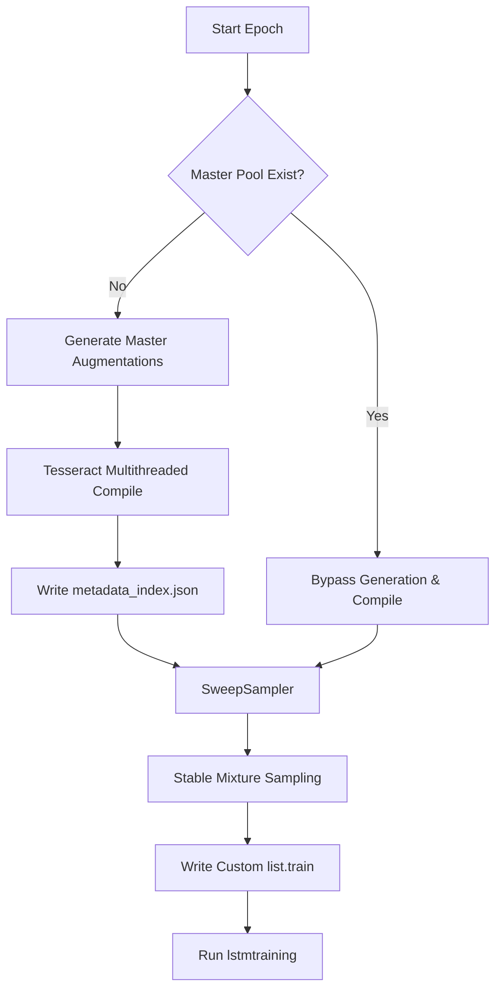

# Mixed Training and Augmentation Specification

This document outlines the theoretical foundation, mathematical formulations, and operational specifications for the Cherokee Phoenix OCR mixed training and augmentation pipeline. It establishes a robust framework to handle historical print variations, ink degradation, and character imbalance, ensuring high-fidelity text recognition.

---

## 1. Stable Seeded Sampling with Salt Strings

To ensure deterministic, reproducible, and verifiable training, validation, and testing splits across dynamic datasets, we implement a stable seeded sampling algorithm using cryptographic hashing salted with specific identifiers. 

Traditional pseudo-random number generator (PRNG) seeding (e.g., `random.seed(42)`) is highly sensitive to the order of dataset traversal and dataset modifications. If a single image is added or removed, the entire assignment shifts. Salted hashing ensures that each sample's assignment is independent of other samples.

### Mathematical Formulation

Let $x$ be a unique identifier for a dataset sample (e.g., a file path or database primary key), and let $S \in \mathbb{R}$ be a string representing the salt (e.g., `"phoenix_ocr_split_v1"`).

We compute the stable MD5 hash value of the combined string representation:

$$\mathcal{H}(x, S) = \text{MD5}(x \mathbin{\Vert} S)$$

Let $\mathcal{V}(x, S)$ be the integer value of the first 8 hex characters of $\mathcal{H}(x, S)$:

$$\mathcal{V}(x, S) = \text{int}(\mathcal{H}(x, S)[0:8], 16)$$

The normalized projection $P(x, S) \in [0, 99]$ is defined as:

$$P(x, S) = \mathcal{V}(x, S) \bmod 100$$

Given target proportions for training ($T_{\text{train}}$), validation ($T_{\text{val}}$), and testing ($T_{\text{test}}$) where $T_{\text{train}} + T_{\text{val}} + T_{\text{test}} = 100$, the sample $x$ is assigned to a split based on the following boundary conditions:

$$\text{Split}(x) = \begin{cases} 
\text{Train}, & \text{if } 0 \le P(x, S) < T_{\text{train}} \\
\text{Validation}, & \text{if } T_{\text{train}} \le P(x, S) < T_{\text{train}} + T_{\text{val}} \\
\text{Test}, & \text{if } T_{\text{train}} + T_{\text{val}} \le P(x, S) < 100 
\end{cases}$$

### Python Implementation

```python
import hashlib

def get_stable_split(sample_id: str, salt: str, train_pct: int = 80, val_pct: int = 10) -> str:
    """Deterministic splitting of samples using salted MD5 hashing."""
    combined = f"{sample_id}_{salt}".encode('utf-8')
    hasher = hashlib.md5(combined)
    hex_digest = hasher.hexdigest()
    
    # Extract first 8 characters and map to [0, 99]
    val = int(hex_digest[:8], 16) % 100
    
    if val < train_pct:
        return "train"
    elif val < (train_pct + val_pct):
        return "val"
    else:
        return "test"

# Example validation
assert get_stable_split("page_001.png", "phoenix_v1") == get_stable_split("page_001.png", "phoenix_v1")
```

---

## 2. Dynamic Epoch-Specific Rotation Logic

During the initial epochs of training, large rotation angles can introduce severe geometric distortion, impeding the model's ability to learn canonical character features. As training progresses and the model learns robust representations, we dynamically expand the bounds of rotational augmentation (progressive curriculum learning).

### Mathematical Model

Let $e$ be the current epoch, and $E$ be the total number of scheduled training epochs. The maximum rotation angle $\theta_{\text{max}}(e)$ at epoch $e$ is defined using a progressive polynomial scaling factor:

$$\theta_{\text{max}}(e) = \theta_{\text{base}} + (\theta_{\text{limit}} - \theta_{\text{base}}) \cdot \left(\frac{e}{E}\right)^\gamma$$

Where:
*   $\theta_{\text{base}}$: The initial maximum rotation angle at epoch $0$ (e.g., $1.0^\circ$).
*   $\theta_{\text{limit}}$: The absolute upper bound of rotation (e.g., $15.0^\circ$).
*   $\gamma \in \mathbb{R}^+$: The curriculum growth rate exponent. If $\gamma = 1$, the scaling is linear. If $\gamma > 1$, augmentation remains mild for longer and grows rapidly near the end. If $\gamma < 1$, it expands quickly in early epochs.

### Implementation inside PyTorch Dataset

```python
import random
import torchvision.transforms.functional as TF
from torch.utils.data import Dataset

class EpochCurriculumDataset(Dataset):
    def __init__(self, samples, theta_base=1.0, theta_limit=15.0, gamma=2.0, total_epochs=100):
        self.samples = samples
        self.theta_base = theta_base
        self.theta_limit = theta_limit
        self.gamma = gamma
        self.total_epochs = total_epochs
        self.current_epoch = 0

    def set_epoch(self, epoch: int):
        self.current_epoch = min(epoch, self.total_epochs)

    def _get_max_rotation(self) -> float:
        ratio = self.current_epoch / self.total_epochs
        return self.theta_base + (self.theta_limit - self.theta_base) * (ratio ** self.gamma)

    def __len__(self):
        return len(self.samples)

    def __getitem__(self, idx):
        img, label = self.samples[idx]
        max_rot = self._get_max_rotation()
        angle = random.uniform(-max_rot, max_rot)
        
        # Apply the dynamic rotation
        img_rotated = TF.rotate(img, angle)
        return img_rotated, label
```

---

## 3. Dynamic Oversampling Formulas

Cherokee historical text contains highly imbalanced character distributions (syllabary frequencies). To prevent the network from overfitting to high-frequency syllables and ignoring minority characters, we apply a dynamic character-level oversampling factor to the text lines.

### Oversampling Formulation

Let $C$ be the set of all Cherokee syllabary characters, and $N_c$ be the raw count of occurrences of character $c \in C$ in the baseline dataset.
For any text line sample $x$, let $C_x \subseteq C$ be the set of unique characters present in $x$'s transcription.

The difficulty metric $\mathcal{D}(x)$ of a sample is proportional to the rarity of its constituent characters:

$$\mathcal{D}(x) = \max_{c \in C_x} \left( \frac{1}{N_c + 1} \right)$$

To construct the dynamic oversampling weight $W(x)$ for line sample $x$, we utilize a smoothed power-law ratio:

$$W(x) = \left( \frac{\max_{y} \mathcal{D}(y)}{\mathcal{D}(x) + \epsilon} \right)^\alpha$$

Where:
*   $\epsilon > 0$ is a stabilization constant (e.g., $10^{-6}$) to prevent division by zero.
*   $\alpha \in [0, 1.0]$ is the smoothing factor. When $\alpha = 0$, sampling is uniform across all samples. When $\alpha = 1.0$, sampling scales linearly with rarity.

### Sampling Probability

The probability $P(x)$ of selecting sample $x$ during batch generation is defined as:

$$P(x) = \frac{W(x)}{\sum_{j=1}^{M} W(j)}$$

Where $M$ is the total size of the unique dataset pool.

---

### 4. Noise Augmentation Parameter Blocks

To simulate ink splatter, bleed-through, paper degradation, and historical scanning artifacts, we execute structured noise injection using pre-calibrated parameter blocks within an Albumentations pipeline.

### Morphological Ink Simulation

To simulate physical print variations (e.g. ink press pressure, ink bleeding, and fading), we implement a custom Morphological Ink Simulation that alters glyph stroke weight on binarized images.

#### Custom Binarization Pre-Check
Because morphological operations behave unpredictably on non-binary images, we first perform a pixel-level check. Let $I$ be the grayscale input image of size $H \times W$. The image is considered binary if more than 90% of its pixels are at extreme values ($0$ or $255$):

$$\frac{\sum_{i=1}^{H} \sum_{j=1}^{W} \mathbb{I}(I_{i,j} = 0 \lor I_{i,j} = 255)}{H \times W} \ge 0.90$$

If this condition is met, the image undergoes morphological variations; otherwise, it is bypassed to prevent geometric distortion of grayscale fields.

#### Mathematical Formulation
The morphological operations are defined using a structured rectangular kernel $K$ of size $k \times k$ where $k \in \{2, 3\}$ is chosen randomly at runtime.

1. **Ink Bleed (Erosion)**: Simulates wet ink expanding into paper fibers, thickening the text characters:
   
   $$(I \ominus K)(x,y) = \min_{(s,t) \in K} I(x+s, y+t)$$
   
   Two distinct eroded variations are appended to the dataset with randomly chosen kernel sizes.

2. **Ink Fade (Dilation)**: Simulates physical print-head degradation or starvation, thinning the text characters:
   
   $$(I \oplus K)(x,y) = \max_{(s,t) \in K} I(x-s, y-t)$$
   
   Two distinct dilated variations are appended with randomly chosen kernel sizes.

---

### Ink Wash and Pixel-Level Blur (Smudging) Noise

This method simulates physical wet-ink bleeding, smudging, and spot-mold deterioration on historical paper, which is particularly common in historical Cherokee scan sources like the Cherokee New Testament (CNT).

#### Mathematical Formulation

Let $I_{i,j}$ be the pixel intensity of the image at coordinate $(i, j)$ in a grayscale or color image of size $H \times W$. Let $\lambda \in [0, 1.0]$ be the intensity scale.

1. **Salt and Pepper Injection**:
   We compute the total number of affected dark ("pepper") pixels $N_{\text{pepper}}$ and light ("salt") pixels $N_{\text{salt}}$:
   
   $$N_{\text{pepper}} = \lfloor H \times W \times \lambda \times 0.05 \rfloor$$
   
   $$N_{\text{salt}} = \lfloor N_{\text{pepper}} / 2 \rfloor$$
   
   - A random set of $N_{\text{pepper}}$ coordinates is selected and set to black ($0$ or $[0,0,0]$) to simulate dark mold spots or physical ink splatter.
   - A random set of $N_{\text{salt}}$ coordinates is selected and set to white ($255$ or $[255,255,255]$) to simulate print fading or paper fiber highlights.

2. **GaussianBlur Smudging**:
   To simulate the physical bleeding of wet ink into neighboring paper fibers, we apply a Gaussian filter to the noisy image:
   
   $$I_{\text{blurred}} = I_{\text{noisy}} * G_k$$
   
   where the kernel size $k$ of the filter $G_k$ is dynamically scaled with the intensity:
   
   $$k = \begin{cases} 
   3 \times 3, & \text{if } \lambda < 0.5 \\
   5 \times 5, & \text{if } \lambda \ge 0.5 
   \end{cases}$$
   
   (ensuring $k$ is always odd and at least $3$).

3. **Intensity Blending**:
   The final smudged image $I_{\text{final}}$ is a linear interpolation of the blurred image and the original image:
   
   $$I_{\text{final}} = \alpha \cdot I_{\text{blurred}} + (1.0 - \alpha) \cdot I_{\text{original}}$$
   
   where the blending coefficient $\alpha = \max(0.1, \min(0.9, \lambda))$ maps the intensity parameter directly to the blending weight.

---

### Pixel-Level Coarse Dropout (Micro-Erasures) Noise

To simulate dry-type ink starvation and physical print-fade (often observed in historical Bible and New Testament print sources like the CNT), we apply high-frequency coarse dropout at a very fine pixel scale.

#### Mathematical Formulation

Let $I_{i, j}$ be the pixel intensity at coordinate $(i, j)$ of a grayscale image. Let $N_H$ be the number of holes, randomly sampled from a range $[h_{\text{min}}, h_{\text{max}}]$ (typically $[20, 60]$ for high-frequency density).

For each hole $k \in \{1, 2, \dots, N_H\}$, we sample a random height $h_k$ and width $w_k$ from the size range $[s_{\text{min}}, s_{\text{max}}]$ (typically $[1, 2]$ pixels for micro-level details) and a random center coordinate $(y_k, x_k)$.

Let $R_k = [y_k - \lfloor h_k/2 \rfloor, y_k + \lceil h_k/2 \rceil] \times [x_k - \lfloor w_k/2 \rfloor, x_k + \lceil w_k/2 \rceil]$ be the rectangular region defined by hole $k$.

For any pixel $(i, j)$ lying inside any rectangular region $R_k$, the intensity is set to the background fill value (typically $255$ for light backgrounds):

$$I_{\text{final}, i, j} = \begin{cases} 255, & \text{if } (i, j) \in \bigcup_{k=1}^{N_H} R_k \text{ with probability } p \\ I_{i, j}, & \text{otherwise} \end{cases}$$

---

### Staged Multi-Scale Elastic and Grid Distortion

Historically printed text documents exhibit multi-scale spatial deformations, which we model using a compound, dual-scale transformation to simulate both localized high-frequency paper warp (elastic transform) and wide-range low-frequency page page-folds and camera skew (grid distortion).

#### Mathematical Formulation

Let $I(x, y)$ be the input pixel intensity at coordinate $(x, y)$.

1. **Local High-Frequency Elastic Distortion**:
   Localized physical warps, paper fiber unevenness, and physical handling distress are modeled using a randomized, smoothed vector field $\Phi_{\text{elastic}}(x, y) = (x + \Delta x_e, y + \Delta y_e)$. The displacement field components $\Delta x_e$ and $\Delta y_e$ are computed by convolving random noise fields with a Gaussian kernel:
   
   $$\Delta x_e = \alpha \cdot (\eta_x * G_{\sigma}), \quad \Delta y_e = \alpha \cdot (\eta_y * G_{\sigma})$$
   
   where $\eta_x, \eta_y \sim \mathcal{N}(0, \mathbf{I})$ represent independent random Gaussian fields, $G_{\sigma}$ is a 2D Gaussian filter with standard deviation $\sigma$ (representing spatial scale), and $\alpha$ is the scaling factor (controlling amplitude).

2. **Wide-Range Low-Frequency Grid Distortion**:
   Large-scale page curvature and binding spine distortion are modeled using a displacement field $\Phi_{\text{grid}}(x, y) = (x + \Delta x_g, y + \Delta y_g)$. The input image domain is divided into a regular grid of size $M \times N$ control cells. Random displacement vectors are sampled at cell vertices and smoothly interpolated across the domain using bicubic splines:
   
   $$\Phi_{\text{grid}}(x, y) = \text{BicubicSpline}(\mathcal{V}_{M, N})$$

3. **Compound Multi-Scale Distortion Flow**:
   In the multi-scale configuration, rather than selecting one distortion type at random, both transforms are applied sequentially (compounded) to simulate realistic paper distress:
   
   $$I_{\text{distorted}}(x, y) = I\left( \Phi_{\text{elastic}}\left( \Phi_{\text{grid}}(x, y) \right) \right)$$
   
   This ensures that local character skewing and shearing effects compound naturally on top of large-scale undulating page curvature, preserving character legibility while maximizing geometric training robustness.

---

### Page Curl and Spine Curvature Distortion

To simulate the non-rigid spatial warp typical of book spines or page margins in historical document scans, we implement a custom OpenCV-based coordinate-mapping utility (`PageCurl` class wrapping `apply_page_curl`). This distortion vertically curves the text lines and horizontally compresses (squishes) text as it approaches the left or right image margin.

#### Mathematical Formulation

Let $I(x, y)$ be the input pixel intensity at coordinate $(x, y)$ of size $H \times W$. Let $w_{\text{curl}}$ be the width of the active distortion region, computed as $w_{\text{curl}} = \max(1, \lfloor W \cdot r_{\text{curl}} \rfloor)$ where $r_{\text{curl}} \in (0, 0.5]$ is the curl width ratio.

We compute the normalized margin distance $t(x) \in [0, 1.0]$ representing how close pixel $x$ is to the affected edge:

$$\text{If direction is left: } t(x) = \max\left(0.0, 1.0 - \frac{x}{w_{\text{curl}}}\right)$$

$$\text{If direction is right: } t(x) = \max\left(0.0, 1.0 - \frac{W - 1.0 - x}{w_{\text{curl}}}\right)$$

##### 1. Vertical Bending (Bending)

Vertical curvature is modeled as a parabolic displacement applied to the $y$-coordinates. Let $b \in \mathbb{R}$ be the bending factor:

$$y_{\text{src}} = y + b \cdot H \cdot t(x)^2$$

This creates a parabolic vertical bend that decays quadratically to zero at a distance $w_{\text{curl}}$ from the margin.

##### 2. Horizontal Compression (Squishing)

Horizontal compression is modeled by mapping normalized coordinates in the active region using a fractional power function. Let $c \in [0, 1.0)$ be the compression intensity, and let $\gamma = \frac{1.0}{1.0 + c}$. 

We map target $x$-coordinates to source $x_{\text{src}}$-coordinates as follows:

*   **For direction left ($x < w_{\text{curl}}$):**
    
    $$x_{\text{src}} = w_{\text{curl}} \cdot \left(\frac{x}{w_{\text{curl}}}\right)^\gamma$$

*   **For direction right ($x > W - 1.0 - w_{\text{curl}}$):**
    
    $$x_{\text{src}} = (W - 1.0) - w_{\text{curl}} \cdot \left(\frac{W - 1.0 - x}{w_{\text{curl}}}\right)^\gamma$$

*   **Outside active regions ($t(x) = 0$):**
    
    $$x_{\text{src}} = x$$

Since $\gamma \le 1.0$, the derivative $\frac{d x_{\text{src}}}{d x} > 1.0$ near the edge, forcing a wider interval of original content in the source image to compress into a narrower target interval near the margins, simulating 3D cylindrical foreshortening.

The final distorted pixel coordinate $(x_{\text{src}}, y_{\text{src}})$ is mapped using bicubic interpolation with replicate border mode:

$$I_{\text{distorted}}(x, y) = I(x_{\text{src}}, y_{\text{src}})$$

This is executed in PyTorch / Albumentations via:
- `PageCurl(curl_width_ratio=0.3, max_bending_factor=0.15, max_compression_factor=0.5, direction="random", p=0.5)`

---

### Mixup-based Bleed-Through Noise

To simulate print-through or bleed-through of text from the reverse side of paper (highly common in thin historical Bible pages), we implement a localized mixup-based bleedthrough.

#### Implementation Workflow
Given a primary line crop image $I_{\text{primary}}$:
1. Select a random background text line image $I_{\text{background}}$ from the training pool.
2. Resize $I_{\text{background}}$ to match the exact dimensions of $I_{\text{primary}}$ using area interpolation.
3. Compute the blended image using linear weighted summation with a randomly chosen low opacity $\beta \in [0.05, 0.15]$:

$$I_{\text{blended}} = (1.0 - \beta) \cdot I_{\text{primary}} + \beta \cdot I_{\text{background}}$$

---

### Configuration Specification (YAML & CLI Parameters)

The dynamic augmentation pipeline exposes complete parameter controls for both standard datasets and highly degraded datasets (such as Cherokee New Testament). Below is the parameter specification and defaults:

| Augmentation Parameter | General Pipeline Default | CNT Pipeline Default | Description |
| :--- | :---: | :---: | :--- |
| **Blur Probability** | `0.5` | `0.6` | Chance to apply Gauss/Motion/Median blur |
| **Blur Kernel Limits** | `(3, 5)` | `(3, 5)` | Min and max kernel sizes for blur filters |
| **Shadow Probability** | `0.4` | `0.5` | Chance to inject simulated page fold shadow |
| **Shadow Dimension** | `5` | `6` | Maximum size of the simulated shadow region |
| **Distortion Probability** | `0.45` | `0.5` | Chance to apply grid and elastic distortions |
| **Distortion Limit** | `0.05` | `0.15` | Maximum grid distortion warp limit |
| **Elastic Alpha** | `1.0` | `1.0` | Scaling factor of the elastic transform displacement |
| **Elastic Sigma** | `15.0` | `15.0` | Gaussian standard deviation for elastic smoothing |
| **Page Curl Probability** | `0.0` | `0.0` | Chance to warp text near the page margins |
| **Dropout Probability** | `0.4` | `0.5` | Chance to drop random large rectangular regions |
| **Dropout Holes** | `(1, 4)` | `(1, 4)` | Number of holes injected per image |
| **Dropout Size** | `(4, 10)` | `(4, 10)` | Maximum height/width of dropout holes in pixels |
| **Micro-Dropout Prob** | `0.0` | `0.4` | High-frequency tiny holes (print-fade) |
| **Micro-Dropout Holes** | `(20, 60)` | `(20, 60)` | Dense grid of pixel-level micro-holes |
| **Micro-Dropout Size** | `(1, 2)` | `(1, 2)` | Dimensions of micro-holes (1-2 pixels) |
| **Smudge Probability** | `0.0` | `0.4` | Chance to apply ink wash/spot-mold blur |
| **Smudge Intensity** | `0.0` | `0.3` | Multiplicative factor for ink wash smudging scale |
| **Bleed-through Prob** | `0.25` | `0.25` | Chance to mix in secondary background lines |
| **Multi-Scale Mode** | `False` | `True` | If `True`, compounds grid + elastic; otherwise chooses `OneOf` |

---

## 5. Binarization and Bypasses

### Binarization Algorithms

The pipeline integrates both global and local adaptive binarization techniques via `doxapy` to convert degraded grayscale text lines to strict binary black-and-white.

#### 1. Otsu's Global Thresholding
Otsu's thresholding calculates an optimal global threshold $t^*$ that divides the image histogram into foreground and background classes by maximizing the between-class variance:

$$\sigma_B^2(t) = \omega_0(t) \omega_1(t) \left[ \mu_0(t) - \mu_1(t) \right]^2$$

Where:
*   $\omega_0(t), \omega_1(t)$ are the probabilities of the foreground and background classes separated by threshold $t$.
*   $\mu_0(t), \mu_1(t)$ are the respective class mean intensities.

#### 2. Sauvola's Local Adaptive Binarization
Sauvola's method computes a local threshold $T(x,y)$ dynamically within a window of size $W \times W$ (clamped to the maximum possible dimension based on image bounds to prevent outer-bound errors). It is optimal for handling uneven illumination and page staining:

$$T(x,y) = m(x,y) \cdot \left[ 1 + k \cdot \left( \frac{s(x,y)}{R} - 1 \right) \right]$$

Where:
*   $m(x,y)$ is the local mean intensity within the window.
*   $s(x,y)$ is the local standard deviation.
*   $R$ is the dynamic range of standard deviation ($128$ for 8-bit grayscale).
*   $k \in [0.1, 0.5]$ is the control parameter (typically $0.2$) adjusting the threshold sensitivity.

#### 3. Su's Adaptive Contrast Binarization
Su's method computes a local threshold using the local image contrast defined at stroke edges:

$$C(x,y) = \frac{I_{\max}(x,y) - I_{\min}(x,y)}{I_{\max}(x,y) + I_{\min}(x,y) + \epsilon}$$

Where $I_{\max}(x,y)$ and $I_{\min}(x,y)$ are the maximum and minimum pixel values within the local neighborhood, and $\epsilon$ is a small stabilization constant. A threshold map is built by interpolating intensities of high-contrast edge pixels.

#### 4. Wolf's Local Adaptive Binarization
Wolf's method modifies Sauvola's formulation to address cases where local contrast is extremely weak (e.g., heavily faded print characters):

$$T(x,y) = (1 - k) \cdot m(x,y) + k \cdot M_{\min} + k \cdot \frac{s(x,y)}{S_{\max}} \cdot (m(x,y) - M_{\min})$$

Where:
*   $M_{\min}$ is the minimum gray level of the entire input image.
*   $S_{\max}$ is the maximum local standard deviation over all local windows across the image.
*   $k$ is a parameter (typically $0.5$).

---

### Binarization Bypass Strategy

Document pre-processing systems frequently utilize global or adaptive binarization to convert images to strict binary black-and-white. However, physical degradation and ink bleed often lead to catastrophic information loss when binarized deterministically before inference.

```
Raw Gray-scale Image  ──► [ Sauvola Binarization ] ──► Broken Glyphs (Information Loss)
          │
          ▼ (Binarization Bypass Route)
 [ Grayscale Augmentations ] ──► [ CNN/ViT Encoder ] ──► Soft Probability Threshold Maps
```

#### Bypass Strategy

1. **Continuous Grayscale Training**: Models are trained directly on raw 8-bit grayscale images containing varying illumination fields. The feature extractor learns a robust boundary definition instead of delegating thresholding to hand-crafted heuristic formulas.
2. **Differentiable Thresholding Layers**: We introduce an optional threshold bypass layer inside the PyTorch forward pass:

$$\tilde{I}_{i,j} = \sigma\left(\frac{I_{i,j} - T_{i,j}}{\tau}\right)$$

Where:
*   $I_{i,j}$ is the normalized grayscale input intensity at pixel $(i, j)$.
*   $T_{i,j}$ is the local Sauvola threshold calculated at $(i, j)$.
*   $\sigma$ is the Sigmoid activation function.
*   $\tau$ is a temperature hyperparameter (e.g., $\tau = 0.05$). As $\tau \to 0$, the activation approaches a hard step-function (strict binarization) while remaining fully differentiable during backpropagation.

---

## 6. Step Learning Rate Decay Maths

We employ a Step Learning Rate Decay schedule to stabilize gradient descent as optimization approaches complex saddle points. The learning rate $\eta_e$ at epoch $e$ is scaled systematically by decay factor $\gamma$ after every fixed interval step size $S$.

### Mathematical Equation

Let $\eta_0$ be the initial learning rate, $S$ be the step size (decay frequency in epochs), and $\gamma$ be the multiplicative factor of learning rate decay.

$$\eta_e = \eta_0 \cdot \gamma^{\lfloor \frac{e}{S} \rfloor}$$

Where:
*   $e \in \mathbb{N}_{\ge 0}$: The zero-indexed active training epoch.
*   $\gamma \in (0, 1.0)$: Typically set to $0.1$ or $0.5$.
*   $S \in \mathbb{N}_{\ge 1}$: Decides how many epochs are executed before the step decay is applied.
*   $\lfloor \cdot \rfloor$: The floor function, ensuring the exponent is a flat integer step.

### Step Decay Schedule Trace

Assuming $\eta_0 = 10^{-3}$, $\gamma = 0.5$, and $S = 20$:

| Epoch Range ($e$) | Exponent $\lfloor e / S \rfloor$ | Learning Rate Formula | Active Learning Rate ($\eta_e$) |
| :--- | :--- | :--- | :--- |
| $[0, 19]$ | $0$ | $10^{-3} \cdot (0.5)^0$ | $1.000 \times 10^{-3}$ |
| $[20, 39]$ | $1$ | $10^{-3} \cdot (0.5)^1$ | $5.000 \times 10^{-4}$ |
| $[40, 59]$ | $2$ | $10^{-3} \cdot (0.5)^2$ | $2.500 \times 10^{-4}$ |
| $[60, 79]$ | $3$ | $10^{-3} \cdot (0.5)^3$ | $1.250 \times 10^{-4}$ |

---

## 7. Dynamic Linear Mixture Decay Schedule

To balance the high structural diversity of Cherokee New Testament (CNT) images with the target high-fidelity of the Phoenix dataset, we employ a **Dynamic Linear Mixture Decay Schedule**. During early stages, we blend in a large fraction of degraded CNT samples to train robust feature extraction. As training converges, we decay the proportion of CNT lines down to zero, allowing the model to focus purely on high-fidelity target domain samples.

### Mathematical Formulation

Let $e$ represent the current epoch ($1 \le e \le E$, where $E$ is the total number of training epochs). Let $M(e)$ represent the target Phoenix ratio in the training mixture at epoch $e$.

The decay schedule is parameterized by:
- $M_{\text{start}}$: The starting Phoenix ratio (e.g., $0.5$).
- $M_{\text{end}}$: The final Phoenix ratio (e.g., $1.0$).
- $e_{\text{start}}$: The epoch at which linear decay begins (e.g., $1$).
- $e_{\text{end}}$: The epoch at which linear decay ends (e.g., $E$).

For any epoch $e$, the dynamic mixture ratio $M(e)$ is defined as:

$$M(e) = \begin{cases}
M_{\text{start}}, & \text{if } e \le e_{\text{start}} \\
M_{\text{end}}, & \text{if } e \ge e_{\text{end}} \\
M_{\text{start}} + (M_{\text{end}} - M_{\text{start}}) \cdot \frac{e - e_{\text{start}}}{e_{\text{end}} - e_{\text{start}}}, & \text{if } e_{\text{start}} < e < e_{\text{end}}
\end{cases}$$

### Dataset Split Sizes

Let $N_{\text{phoenix}}$ be the number of unique Phoenix training samples available. The required number of Cherokee New Testament (CNT) lines $N_{\text{cnt}}(e)$ to sample for epoch $e$ is calculated dynamically as:

$$N_{\text{cnt}}(e) = \begin{cases}
0, & \text{if } M(e) = 1.0 \\
\lfloor N_{\text{phoenix}} \cdot \frac{1.0 - M(e)}{M(e)} \rfloor, & \text{if } 0 < M(e) < 1.0
\end{cases}$$

---

## 8. Execution Commands with `uv`

All pipeline operations, training tasks, and dependency resolutions must be executed using `uv` to maintain system virtual environment reproducibility.

### Environment Setup and Dependencies

Initialize and sync the environment lockfile:

```bash
# Sync local virtual environment with lockfile
uv sync
```

To add the required visual degradation, processing, and training dependencies:

```bash
# Install core computer vision and deep learning packages
uv add albumentations torch torchvision numpy opencv-python pyyaml
```

### Running the Mixed Augmentation and Training Pipeline

To launch the training pipeline with our epoch curriculum, salted split generation, and binarization bypasses:

```bash
# Run training using the production configuration
uv run scripts/train_staged.py \
  --config config/mixed_training_config.yaml \
  --salt "phoenix_ocr_split_v1" \
  --total-epochs 100 \
  --step-size 20 \
  --gamma-decay 0.5
```

To verify the deterministic nature of the dataset splits:

```bash
# Verify data distribution split using stable salted sampling
uv run scripts/verify_splits.py --dataset-dir data/raw --salt "phoenix_ocr_split_v1"
```

---

## 9. Unified Shared-Pool Sweep Augmentation

To scale hyperparameter sweeps across multiple mixture ratios and augmentation settings, we utilize a **Unified Shared-Pool Sweep Augmentation** architecture. 

### Architecture Overview

Traditional hyperparameter sweeps run independent pipelines for each experimental configuration, resulting in $O(N 	imes E 	imes M)$ visual augmentation and Tesseract OCR compilation steps (where $N$ is sample size, $E$ is epoch count, and $M$ is the number of experimental runs).

The Shared-Pool architecture decouples **Augmentation Generation** from **Experiment Sampling**:
1. **Master Pool Generation (Once per Epoch)**: At the start of an epoch $e$, a master pool of fully augmented images is generated under `training_data/staged_tuning/master_pool_epoch_{e}`. All generated variations are compiled to `.lstmf` files in parallel using Tesseract. A metadata index (`metadata_index.json`) tracks the properties of each variation (dataset origin, sample ID, presence of rare characters, binarization algorithm, etc.).
2. **Dynamic Sweep Sampling (Per Experiment)**: When an individual model experiment runs, it completely bypasses both image processing and Tesseract compilation. Instead, the `SweepSampler` utility parses `metadata_index.json`, partitions the pool, and uses seeded stable sampling to construct a custom `list.train` file containing only the specific mixture subset matching the target ratio.



### Dynamic Sweep Sampling Formulation

Let $P$ be the set of unique Phoenix samples in the master pool, and $C$ be the set of unique CNT samples. The target mixture ratio is $\mu \in [0.0, 1.0]$ representing the proportion of Phoenix lines.

The required number of unique CNT samples to select, $n_c$, is computed as:

$$n_c = \lfloor |P| \cdot \frac{1.0 - \mu}{\mu} \rfloor$$

If no Phoenix samples are present (such as in dry-runs or test environments), we fallback to fraction-based CNT selection:

$$n_c = \lfloor |C| \cdot (1.0 - \mu) \rfloor$$

We partition $C$ into $C_{\text{rare}}$ (samples containing at least one rare character) and $C_{\text{common}}$. To address character imbalance, we prioritize rare samples:

$$\text{Sampled } C = \begin{cases}
C_{\text{rare}}[:n_c], & \text{if } |C_{\text{rare}}| \ge n_c \\
C_{\text{rare}} \cup C_{\text{common}}[:n_c - |C_{\text{rare}}|], & \text{otherwise}
\end{cases}$$

### Performance Benefits

By reusing the pre-compiled `.lstmf` files across experiments, the setup time for subsequent sweep runs is reduced from **minutes to milliseconds** ($O(1)$ setup time), enabling extremely fast, scalable hyperparameter search.

---

## 8. 1-bit TIFF Intermediate Format Compression

To minimize the disk space footprint of intermediate generated binarized line crops and speed up compilation setup, the augmentation pipeline natively uses **1-bit compressed TIFF format** with **CCITT Group 4** compression instead of raw PNG.

### Advantages of CCITT Group 4 TIFF:
1. **Extreme Compression**: CCITT Group 4 is designed specifically for binarized images (black and white document pages) and achieves **60%-70% disk space savings** compared to standard PNG.
2. **Seamless Tesseract Integration**: Tesseract natively consumes TIFF files with zero translation overhead, ensuring extremely fast `.lstmf` compilation.
3. **No Quality Loss**: Because Group 4 is a lossless compression algorithm tailored for 1-bit images, OCR accuracy (CER/WER) remains 100% identical to uncompressed or PNG pipelines.

