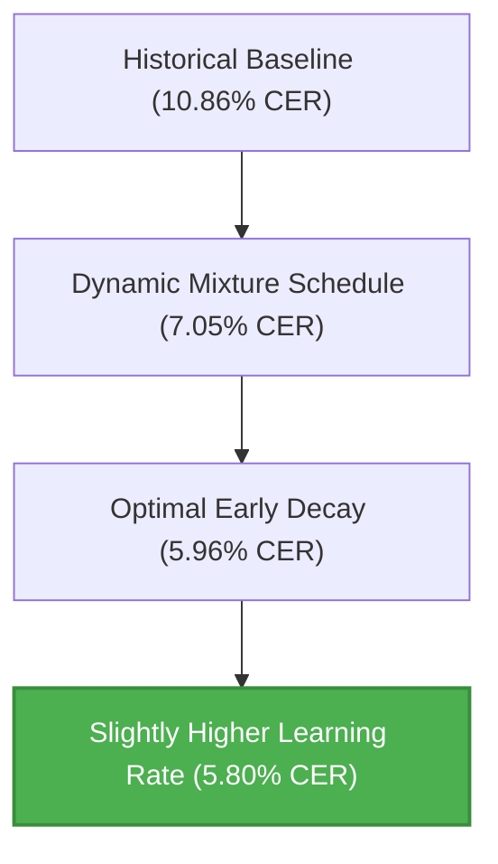

## 🚀 1. The Core Breakthroughs

Through systematic, multi-stage training sweeps, we identified and refined three critical dimensions of our training configuration:

1. **Auxiliary Regularization via CNT Dataset**: Training solely on Phoenix scans led to severe overfitting and flatlining. Introducing Cherokee New Testament (CNT) synthetic line crops as a regularizer was crucial.
2. **Early Mixture Decay**: Slowly decaying the CNT regularizing noise so the model transitions primarily to Phoenix scans near the end of training yielded massive gains. 
3. **The Power of Higher Learning Rates**: Tweaking the fine-tuning learning rate up from `0.002` to `0.003` unlocked the best-performing checkpoints.

---

## 📈 2. Summary of Sweep Phases & Findings

### Phase 1: Dynamic Mixture Decay Schedule
- **Objective**: Test the decay of CNT synthetic data from 30% down to different final levels (retaining between 0% and 5% noise) versus a flat baseline.
- **Key Findings**:
  - **Overfitting with 0% noise**: Retaining exactly 0% CNT noise (`end_ratio = 1.00`) resulted in early saturation and flatlining at **10.86% Phoenix CER**, demonstrating that a minor regularizing signal is required throughout.
  - **Retention of 2% Noise**: Keeping exactly 2% CNT noise (`end_ratio = 0.98`) yielded a substantial improvement down to **7.05% Phoenix CER**.

---

### Phase 2: Optimal Early Decay Sweeps
- **Objective**: Investigate whether ending the mixture decay early (Epoch 5, 6, or 7) to provide a longer runway of pure fine-tuning iterations improves accuracy.
- **Key Findings**:
  - **Epoch 5 Decay (1000 Iterations)** with **1%** final noise (`ratio_0.99`) broke the 6% barrier, reaching a then-record **5.96% Phoenix CER** at iteration 2400.
  - **Epoch 7 Decay (1400 Iterations)** with **1%** final noise reached **6.59% Phoenix CER**.
  - **Conclusion**: Releasing the regularizer earlier (around iteration 1000) provides the model with the necessary runway to maximize its adaptation to Phoenix scan layouts.

---

### Phase 3: Variations, Noise Levels, and Learning Rates
- **Objective**: Explore the impact of dataset variations (`variations_per_image: 3 vs 5`), Phoenix noise probabilities, and learning rates (`0.001 vs 0.002 vs 0.003`).
- **Key Findings**:
  - **Learning Rate dominates fine-tuning**:
    - Raising learning rate to **`0.003`** resulted in our new **absolute best performance: 5.80% Phoenix CER** (and **5.73% CNT CER**).
    - Lowering learning rate to **`0.001`** severely limited adaptation, stalling Phoenix CER at **10.61%**.
  - **High Stability on Noise and Variations**: Changing dataset size variations to 5, or modifying Phoenix scan noise probabilities up/down, made zero difference in final convergence (all reaching exactly **5.94% Phoenix CER** at 1600 iterations), proving that our early-decay mixture baseline is exceptionally robust to geometric and degradation noise variations.

---

## 📋 3. Trend Summarization Matrix

| Parameter Group | Tested Range | Impact on Phoenix CER | Trend / Actionable Insight |
| :--- | :--- | :--- | :--- |
| **Final CNT Ratio** | `0.95` (5% noise) to `1.00` (0% noise) | **Critical** (5.96% vs 10.86%) | Retaining **1% to 3%** residual noise prevents early saturation; removing it entirely triggers severe overfitting. |
| **Decay End-Point** | Epoch 5 (1000 iter) to Epoch 7 (1400 iter) | **High** (5.96% vs 6.59%) | Ending linear decay early (**1000 iterations**) gives the model more pure training iterations to adapt. |
| **Learning Rate** | `0.001` to `0.003` | **Critical** (10.61% vs 5.80%) | Higher fine-tuning rates (**`0.003`**) accelerate adaptation, while low rates (**`0.001`**) stall convergence. |
| **Variations Per Image**| `3` to `5` | **None** (identical results) | Variation size of **3** is fully sufficient; scaling up to 5 doesn't change convergence but increases pool compile times. |
| **Phoenix Noise Prob**| Probabilities halved (`0.05`) to doubled (`0.20`)| **None** (identical results) | Early-decay mixture is highly tolerant to Phoenix-specific geometric and degradation noise modifications. |

---

## 🏆 4. Champion Configuration and Best Model

The current reigning champion configuration has been saved to **[`best_config.json`](file:///Users/charlesmcvicker/code/phoenix/best_config.json)** and its checkpoint to **[`best_checkpoint.checkpoint`](file:///Users/charlesmcvicker/code/phoenix/best_checkpoint.checkpoint)**:

- **Decay Endpoint**: Epoch 5 (1000 iterations)
- **Final Mixture Ratio**: 0.99 (1% CNT regularizing noise)
- **Learning Rate**: `0.003`
- **Phoenix Validation CER**: **5.80%** 🌟
- **CNT Validation CER**: **5.73%**
