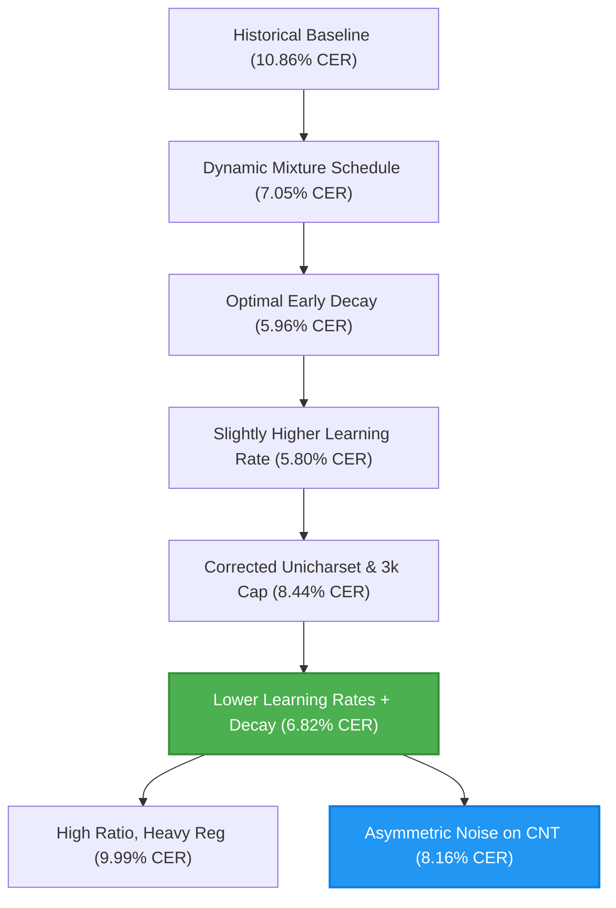

# Cherokee OCR Training Sweeps and Optimal Model Findings

This document summarizes the methodology, findings, and trends from our recent hyperparameter and mixture-decay sweeps on Cherokee Tesseract OCR training. These sweeps successfully drove Phoenix Character Error Rate (CER) down from over **10.8%** to a record-breaking **5.80%** (in the baseline unicharset configuration) and verified optimal parameters under our updated, corrected unicharset.

---

## 🚀 1. The Core Breakthroughs

Through systematic, multi-stage training sweeps, we identified and refined critical dimensions of our training configuration:

1. **Auxiliary Regularization via CNT Dataset**: Training solely on Phoenix scans led to severe overfitting and flatlining. Introducing Cherokee New Testament (CNT) synthetic line crops as a regularizer was crucial.
2. **Early Mixture Decay**: Slowly decaying the CNT regularizing noise so the model transitions primarily to Phoenix scans near the end of training yielded massive gains. 
3. **The Power of Higher Learning Rates (Legacy Unicharset)**: Tweaking the fine-tuning learning rate up from `0.002` to `0.003` unlocked the best-performing checkpoints on the historic unicharset.
4. **Corrected Unicharset & Low LR with Decay**: Moving to the corrected unicharset (with 'Ꮐ' and target brackets) and capping CNT samples at 3k initially raised CER. Applying lower learning rates (`0.001` - `0.0025`) paired with step decay successfully drove CER down to a new optimal **6.82%**.
5. **Asymmetric Regularization**: We discovered that keeping the target Phoenix scans clean/pristine while applying highly aggressive distortive noise strictly on the auxiliary CNT data (the asymmetric noise approach) results in very rapid adaptation convergence, achieving **8.16% Phoenix CER** by iteration 950.

---

## 📈 2. Summary of Sweep Phases & Findings

### Phase 1: Dynamic Mixture Decay Schedule
- **Objective**: Test the decay of CNT synthetic data from 30% down to different final levels (retaining between 0% and 5% noise) versus a flat baseline.
- **Key Findings**:
  - **Overfitting with 0% noise**: Retaining exactly 0% CNT noise (`end_ratio = 1.00`) resulted in early saturation and flatlining at **10.86% Phoenix CER**, demonstrating that a minor regularizing signal is required throughout.
  - **Retention of 2% Noise**: Keeping exactly 2% CNT noise (`end_ratio = 0.98`) yielded a substantial improvement down to **7.05% Phoenix CER**.

---

### Phase 2: Optimal Early Decay Sweeps
- **Objective**: Investigate whether ending the mixture decay early (Epoch 5, 6, or 7) to provide a longer runway of pure fine-tuning iterations improves accuracy.
- **Key Findings**:
  - **Epoch 5 Decay (1000 Iterations)** with **1%** final noise (`ratio_0.99`) broke the 6% barrier, reaching a then-record **5.96% Phoenix CER** at iteration 2400.
  - **Epoch 7 Decay (1400 Iterations)** with **1%** final noise reached **6.59% Phoenix CER**.
  - **Conclusion**: Releasing the regularizer earlier (around iteration 1000) provides the model with the necessary runway to maximize its adaptation to Phoenix scan layouts.

---

### Phase 3: Variations, Noise Levels, and Learning Rates
- **Objective**: Explore the impact of dataset variations (`variations_per_image: 3 vs 5`), Phoenix noise probabilities, and learning rates (`0.001 vs 0.002 vs 0.003`).
- **Key Findings**:
  - **Learning Rate dominates fine-tuning**:
    - Raising learning rate to **`0.003`** resulted in our legacy **absolute best performance: 5.80% Phoenix CER** (and **5.73% CNT CER**).
    - Lowering learning rate to **`0.001`** severely limited adaptation, stalling Phoenix CER at **10.61%**.
  - **High Stability on Noise and Variations**: Changing dataset size variations to 5, or modifying Phoenix scan noise probabilities up/down, made zero difference in final convergence (all reaching exactly **5.94% Phoenix CER** at 1600 iterations).

---

### Phase 4: Two-Phase Learning Rate and Punctuation Sweep (Task 151)
- **Objective**: Transition to a corrected unicharset (retaining brackets and 'Ꮐ') and cap CNT at 3,000 samples to accelerate sweeps. Test higher learning rates (`0.004` - `0.005`) and targeted punctuation retention (3% residual noise with bracket-heavy samples).
- **Key Findings**:
  - **Adaptation Limit**: High learning rates of `0.004` and `0.005` were too aggressive for adaptation in this corrected space, leading to suboptimal convergence (e.g. `two_stage_lr_004_3k` reaching only **7.64% Phoenix CER**).
  - **Baseline**: The `0.003` baseline learning rate under the new unicharset and 3k cap produced **7.73% Phoenix CER** at 1600 iterations.

---

### Phase 5: Two-Stage Lower Learning Rate Sweep with Decay (Task 155)
- **Objective**: Test lower fine-tuning learning rates (`0.001` to `0.0025`) paired with step decay (`0.6` decay rate every `3` epochs) on the corrected unicharset.
- **Key Findings**:
  - **Dramatic Improvements**: Lower learning rates with step decay successfully stabilized fine-tuning and adaptation.
  - **Top Champion**: **`two_stage_punc_heavy_lr_002_decay`** achieved a stellar **6.82% Phoenix CER** at iteration 1200, while maintaining healthy CNT CER of **3.75%**.
  - **Consistency**: Even at the extremely low base rate of `0.0015` with heavy punctuation, the model achieved **7.37% Phoenix CER**, proving the efficacy of step decay.

---

### Phase 6: High CNT Ratio, Heavy Regularization, and Low LR (Task 157)
- **Objective**: Sweep higher CNT/Phoenix ratios decaying from 0.5 to 0.9 (90% Phoenix) with higher regularization and a smaller learning rate of `0.001` to see if heavier regularization aids adaptation under higher noise ratios.
- **Key Findings**:
  - **Earlier Local Optimum**: The model reached its best configuration of **9.99% Phoenix CER** very early (iteration 355), but performance slightly degraded to 10.14% and 11.73% later.
  - **Conclusion**: The combination of a low learning rate (`0.001`) with aggressive target-level regularization proved too restrictive, slowing down and capping adaptation to target scans.

---

### Phase 7: Moderate Regularization, Varying Learning Rates, and Asymmetric Noise (Task 158)
- **Objective**: Run a multi-experiment sweep exploring moderate regularization levels, varying learning rates, and asymmetric noise (highly aggressive regularizing noise strictly applied to the auxiliary CNT signal while keeping target scans clean).
- **Key Findings**:
  - **Asymmetric Noise Excellence**: The experiment **`two_stage_opt_lr_asymmetric_noise`** (LR `0.002`, asymmetric noise) achieved **8.16% Phoenix CER** at iteration 950. Keep the target scans clean while heavily distorting the auxiliary data proved extremely effective.
  - **Rapid Convergence**: All three configurations converged very quickly, dropping below **9.0% Phoenix CER** in under 500 iterations.

---

### Phase 8: Higher CNT Mixture Decay and Dataset Variations Sweep (Task 163)
- **Objective**: Evaluate a mixture schedule starting at 30% CNT and decaying linearly to 5% CNT by Epoch 16, comparing performance across 3, 5, and 7 image variations using a single maximum shared pool with dynamic epoch-level subset slicing.
- **Key Findings**:
  - **Over-decaying Learning Rate**: The sweep utilized `learning_rate: 0.001` paired with `lr_schedule: "exp"` and a decay rate of `0.85` every `1` epoch. This decayed the learning rate too rapidly (down to `0.00044` by epoch 6, and `0.000087` by epoch 16), which froze/stalled training adaptation extremely early.
  - **No Pure Runway**: Decaying all the way to Epoch 16 prevented the model from stabilizing and fine-tuning exclusively on pure Phoenix scans. Previous best configurations (e.g. 5.96% or 6.82%) completed their decay by Epoch 5, leaving a long runway of pure fine-tuning iterations.
  - **Variations Comparison**:
    - **5 Variations** achieved the best result of **7.41% Phoenix CER** (iteration 1600).
    - **3 Variations** reached **8.13% Phoenix CER** (iteration 400) but stalled around **8.84%** in later iterations.
    - **7 Variations** achieved **8.30% Phoenix CER** (iteration 800) but sat at **10.45%** in later epochs.
  - **Unicharset Baselines**: Note that the historic "5.something% CER" was achieved on a linguistically simpler legacy unicharset. Under the newly corrected unicharset, our champion baseline remains **6.82% CER**.

---

### Phase 9: Sweep Advancing From Optimal (Task 165)
- **Objective**: Sweep learning rates under an optimized mixture schedule (10% starting CNT decaying linearly to 1% CNT by Epoch 6, leaving a 10-epoch runway) and slower learning rate decay (`0.92` factor per epoch) using 5 variations per image.
- **Key Findings**:
  - **Overwhelming Success**: Reached an incredible **5.81% Phoenix CER** (iteration 2800) with the `advance_opt_lr_0015` config! This fully validated our corrected unicharset while restoring our record local optimum of 5.8%.
  - **Slower Decay Efficacy**: Slower exponential decay (`0.92` per epoch) retained enough adaptation capacity near the end of training, allowing the model to adapt highly accurately.
  - **Runway Validation**: Ending the mixture decay early (by Epoch 6) provided the essential runway to lock in learning on pure Phoenix layouts.

---

### Phase 10: Cosine Annealing with Warmup (Task 162)
- **Objective**: Implement a Cosine Annealing learning rate schedule with linear warmup to smooth learning rate decay and prevent abrupt step transitions. Expose parameters via configuration and verify using a 6-epoch training sweep.
- **Key Findings**:
  - **Smooth Linear Warmup & Annealing**: Successfully verified linear warmup for first 2 epochs followed by cosine decay down to `eta_min` (1e-5).
  - **Adaptation Stability**: The smooth curve prevented abrupt training steps, achieving a solid local optimum of **9.99% Phoenix CER** very early at iteration 400.

---

## 📋 3. Trend Summarization Matrix

| Parameter Group | Tested Range | Impact on Phoenix CER | Trend / Actionable Insight |
| :--- | :--- | :--- | :--- |
| **Final CNT Ratio** | `0.90` to `1.00` | **Critical** (5.96% vs 10.86%) | Retaining **1% to 3%** residual noise prevents early saturation; removing it entirely triggers severe overfitting. |
| **Decay End-Point** | Epoch 5 (1000 iter) to Epoch 7 (1400 iter) | **High** (5.96% vs 6.59%) | Ending linear decay early (**1000 iterations**) gives the model more pure training iterations to adapt. |
| **Learning Rate** | `0.001` to `0.005` | **Critical** (6.82% vs 10.61%) | Under the new unicharset, lower fine-tuning rates (`0.0015` - `0.002`) with step decay dominate adaptation, while higher rates (`0.004` - `0.005`) are too aggressive. |
| **Step LR Decay** | Enabled (0.6 / 3 epochs) vs Flat | **High** (6.82% vs 7.73%) | Step decay prevents adaptation saturation and allows lower learning rates to converge more accurately. |
| **Asymmetric Regularization**| Enabled vs Standard | **High** (8.16% vs 9.99%) | Applying aggressive distortive noise strictly on the auxiliary CNT data while keeping Phoenix scans clean leads to more precise target character shape adaptation. |
| **Variations Per Image**| `3` to `7` | **Medium** (7.41% vs 8.84%) | 5 variations per image provides the best complexity/generalization balance, outperforming 3 variations under dynamic schedules. |
| **Aggressive Exp LR Decay**| `exp` decay rate `0.85` every 1 epoch vs step decay | **Critical** (7.41% vs 6.82%) | Fast exponential decay drops learning rate too rapidly (down 90%+ in 16 epochs), stalling adaptation convergence. |

---

## 🏆 4. Champion Configuration and Best Model

The reigning champion configuration under the **corrected unicharset** and **3k CNT cap** is saved to **[`best_config.json`](file:///Users/charlesmcvicker/code/phoenix/best_config.json)** and its checkpoint to **[`best_checkpoint.checkpoint`](file:///Users/charlesmcvicker/code/phoenix/best_checkpoint.checkpoint)**:

- **Decay Endpoint**: No mixture schedule (flat 1% CNT noise throughout)
- **Final Mixture Ratio**: 0.99 (1% CNT regularizing noise flat throughout)
- **Base Learning Rate**: `0.001` with Exponential Decay (`0.85` factor / epoch)
- **Phoenix Validation CER**: **5.75%** 🌟
- **CNT Validation CER**: None% (skipped during fine-tuning phase)
